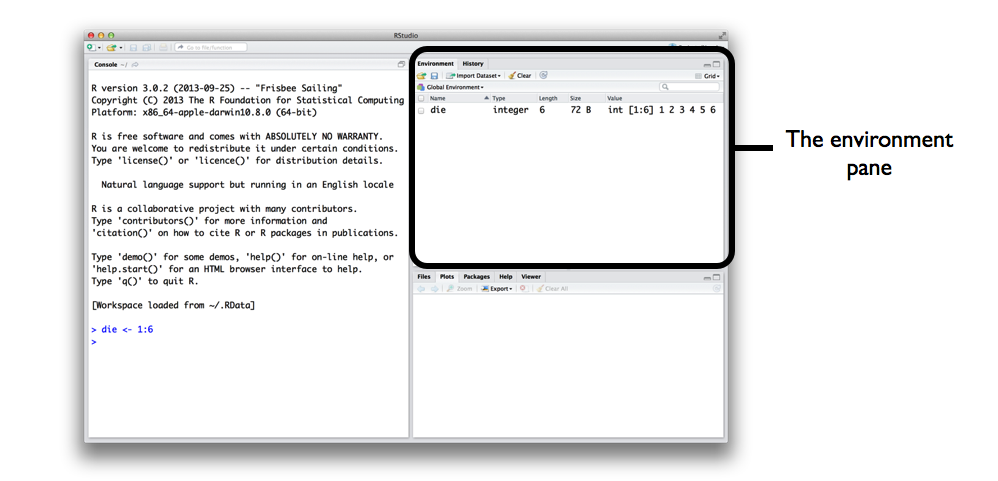
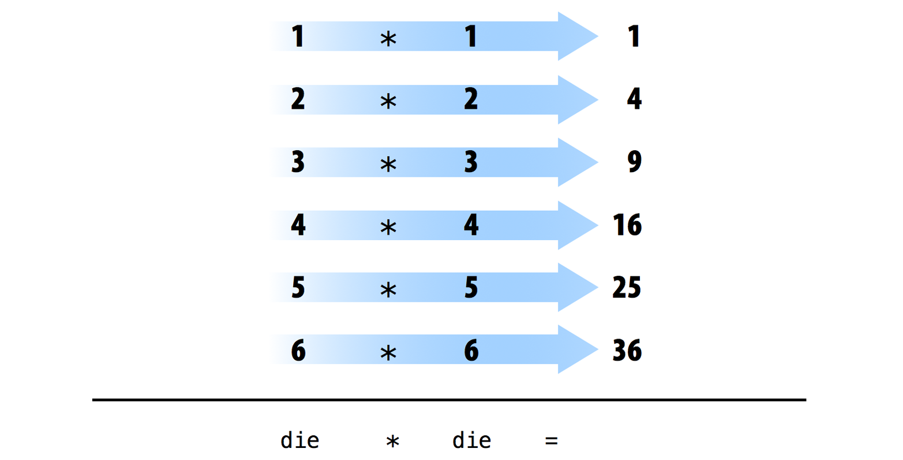

# The Very Basics {#basics}

This chapter provides a broad overview of the R language that will get you programming right away. In it, you will build a pair of virtual dice that you can use to generate random numbers. Don't worry if you've never programmed before; the chapter will teach you everything you need to know. 

To simulate a pair of dice, you will have to distill each die into its essential features. You cannot place a physical object, like a die, into a computer (well, not without unscrewing some screws), but you can save _information_ about the object in your computer's memory.

Which information should you save? In general, a die has six important pieces of information: when you roll a die, it can only result in one of six numbers: 1, 2, 3, 4, 5, and 6. You can capture the essential characteristics of a die by saving the numbers 1, 2, 3, 4, 5, and 6 as a group of values in your computer's memory. 

Let's work on saving these numbers first, and then consider a method for "rolling" our die.

## The R User Interface

Before you can ask your computer to save some numbers, you'll need to know how to talk to it. That's where R and RStudio come in. RStudio gives you a way to talk to your computer. R gives you a language to speak in. To get started, open RStudio just as you would open any other application on your computer. When you do, a window should appear in your screen like the one shown in \@ref(fig:console). 

```{r console, echo = FALSE, fig.cap="Your computer does your bidding when you type R commands at the prompt in the bottom line of the console pane. Don't forget to hit the Enter key. When you first open RStudio, the console appears in the pane on your left, but you can change this with File > Preferences in the menu bar."}
knitr::include_graphics("images/hopr_0101.png")
```

```{block2, install-tip, type='rmdimportant'}
If you do not yet have R and RStudio intalled on your computer--or do not know what I am talking about--visit [Appendix A](#starting). The appendix will give you an overview of the two free tools and tell you how to download them. 
```

The RStudio interface is simple. You type R code into the bottom line of the RStudio console pane and then click Enter to run it. The code you type is called a _command_, because it will command your computer to do something for you. The line you type it into is called the _command line_.

When you type a command at the prompt and hit Enter, your computer executes the command and shows you the results. Then RStudio displays a fresh prompt for your next command. For example, if you type `1 + 1` and hit Enter, RStudio will display:

```
> 1 + 1
[1] 2
>
```

You'll notice that a `[1]` appears next to your result. R is just letting you know that this line begins with the first value in your result. Some commands return more than one value, and their results may fill up multiple lines. For example, the command `100:130` returns 31 values; it creates a sequence of integers from 100 to 130. Notice that new bracketed numbers appear at the start of the second and third lines of output. These numbers just mean that the second line begins with the 14th value in the result, and the third line begins with the 25th value. You can mostly ignore the numbers that appear in brackets:

```
> 100:130
 [1] 100 101 102 103 104 105 106 107 108 109 110 111 112
[14] 113 114 115 116 117 118 119 120 121 122 123 124 125
[25] 126 127 128 129 130
```

```{block2, colon, type = "rmdtip"}
The colon operator (`:`) returns every integer between two integers. It is an easy way to create a sequence of numbers.
```

```{block2, language, type = "rmdnote"}
**Isn't R a language?**

You may hear me speak of R in the third person. For example, I might say, "Tell R to do this" or "Tell R to do that", but of course R can't do anything; it is just a language. This way of speaking is shorthand for saying, "Tell your computer to do this by writing a command in the R language at the command line of your RStudio console." Your computer, and not R, does the actual work.

Is this shorthand confusing and slightly lazy to use? Yes. Do a lot of people use it? Everyone I know--probably because it is so convenient.
```

```{block2, compile, type = "rmdnote"}
**When do we compile?**

In some languages, like C, Java, and FORTRAN, you have to compile your human-readable code into machine-readable code (often 1s and 0s) before you can run it. If you've programmed in such a language before, you may wonder whether you have to compile your R code before you can use it. The answer is no. R is a dynamic programming language, which means R automatically interprets your code as you run it. 
```

If you type an incomplete command and press Enter, R will display a `+` prompt, which means R is waiting for you to type the rest of your command. Either finish the command or hit Escape to start over:

```
> 5 -
+
+ 1
[1] 4
```

If you type a command that R doesn't recognize, R will return an error message. If you ever see an error message, don't panic. R is just telling you that your computer couldn't understand or do what you asked it to do. You can then try a different command at the next prompt:

```
> 3 % 5
Error: unexpected input in "3 % 5"
>
```
Once you get the hang of the command line, you can easily do anything in R that you would do with a calculator. For example, you could do some basic arithmetic:

```r
2 * 3   
## 6

4 - 1   
## 3

6 / (4 - 1)   
## 2
```

Did you notice something different about this code? I've left out the `>`'s and `[1]`'s. This will make the code easier to copy and paste if you want to put it in your own console. 

R treats the hashtag character, `#`, in a special way; R will not run anything that follows a hashtag on a line. This makes hashtags very useful for adding comments and annotations to your code. Humans will be able to read the comments, but your computer will pass over them. The hashtag is known as the _commenting symbol_ in R.

For the remainder of the book, I'll use hashtags to display the output of R code. I'll use a single hashtag to add my own comments and a double hashtag, `##`, to display the results of code. I'll avoid showing `>`s and `[1]`s unless I want you to look at them.

```{block2, cancelling, type = "rmdimportant"}
**Cancelling commands**

Some R commands may take a long time to run. You can cancel a command once it has begun by pressing ctrl + c. Note that it may also take R a long time to cancel the command. 
```

```{exercise, name="Magic with Numbers"}
That's the basic interface for executing R code in RStudio. Think you have it? If so, try doing these simple tasks. If you execute everything correctly, you should end up with the same number that you started with: 

1. Choose any number and add 2 to it.
2. Multiply the result by 3.
3. Subtract 6 from the answer.
4. Divide what you get by 3.
```

Throughout the book, I'll put exercises in chunks, like the one above. I'll follow each exercise with a model answer, like the one below. 

```{solution}
You could start with the number 10, and then do the following steps:
```

```r
10 + 2
## 12

12 * 3
## 36

36 - 6
## 30

30 / 3
## 10
```

## Objects

Now that you know how to use R, let's use it to make a virtual die. The `:` operator from a couple of pages ago gives you a nice way to create a group of numbers from one to six. The `:` operator returns its results as a __vector__, a one-dimensional set of numbers:

```r
1:6
## 1 2 3 4 5 6
```

That's all there is to how a virtual die looks! But you are not done yet. Running `1:6` generated a vector of numbers for you to see, but it didn't save that vector anywhere in your computer's memory. What you are looking at is basically the footprints of six numbers that existed briefly and then melted back into your computer's RAM. If you want to use those numbers again, you'll have to ask your computer to save them somewhere. You can do that by creating an R _object_.

R lets you save data by storing it inside an R object. What is an object? Just a name that you can use to call up stored data. For example, you can save data into an object like _`a`_ or _`b`_. Wherever R encounters the object, it will replace it with the data saved inside, like so:

```r
a <- 1
a
## 1

a + 2
## 3
```

```{block2, objects, type = "rmdnote"}
**What just happened?**
  
1. To create an R object, choose a name and then use the less-than symbol, `<`, followed by a minus sign, `-`, to save data into it. This combination looks like an arrow, `<-`. R will make an object, give it your name, and store in it whatever follows the arrow. So `a <- 1` stores `1` in an object named `a`.
2. When you ask R what's in `a`, R tells you on the next line.
3. You can use your object in new R commands, too. Since `a` previously stored the value of `1`, you're now adding `1` to `2`.
```

So, for another example, the following code would create an object named `die` that contains the numbers one through six. To see what is stored in an object, just type the object's name by itself:

```r
die <- 1:6

die
## 1 2 3 4 5 6
```

When you create an object, the object will appear in the environment pane of RStudio, as shown in \@ref(fig:environment). This pane will show you all of the objects you've created since opening RStudio.

```{r, environment, echo = FALSE, fig.cap = "The RStudio environment pane keeps track of the R objects you create."}

```

You can name an object in R almost anything you want, but there are a few rules. First, a name cannot start with a number. Second, a name cannot use some special symbols, like `^`, `!`, `$`, `@`, `+`, `-`, `/`, or `*`:

|Good names|Names that cause errors
|----------|----------
|a         | 1trial
|b         | $
|FOO       | ^mean
|my_var    | 2nd
|.day      | !bad


```{block2, capitalization, type = "rmdwarning"}
**Capitalization**
  
R is case-sensitive, so `name` and `Name` will refer to different objects:

`Name <- 1`  
`name <- 0`  
  
`Name + 1`  
`## 2`  
```

Finally, R will overwrite any previous information stored in an object without asking you for permission. So, it is a good idea to _not_ use names that are already taken:

```r
my_number <- 1
my_number 
## 1

my_number <- 999
my_number
## 999
```

You can see which object names you have already used with the function `ls`:

```r
ls()
## "a"         "die"       "my_number" "name"     "Name"     
```

You can also see which names you have used by examining RStudio's environment pane.

You now have a virtual die that is stored in your computer's memory. You can access it whenever you like by typing the word *`die`*. So what can you do with this die? Quite a lot. R will replace an object with its contents whenever the object's name appears in a command. So, for example, you can do all sorts of math with the die. Math isn't so helpful for rolling dice, but manipulating sets of numbers will be your stock and trade as a data scientist. So let's take a look at how to do that:

```r
die - 1
## 0 1 2 3 4 5

die / 2
## 0.5 1.0 1.5 2.0 2.5 3.0

die * die
## 1  4  9 16 25 36
```

If you are a big fan of linear algebra (and who isn't?), you may notice that R does not always follow the rules of matrix multiplication. Instead, R uses _element-wise execution_. When you manipulate a set of numbers, R will apply the same operation to each element in the set. So for example, when you run *`die - 1`*, R subtracts one from each element of `die`. 

When you use two or more vectors in an operation, R will line up the vectors and perform a sequence of individual operations. For example, when you run *`die * die`*, R lines up the two `die` vectors and then multiplies the first element of vector 1 by the first element of vector 2. R then multiplies the second element of vector 1 by the second element of vector 2, and so on, until every element has been multiplied. The result will be a new vector the same length as the first two, as shown in \@ref(fig:elementwise).

```{r elementwise, echo = FALSE, fig.cap = "When R performs element-wise execution, it matches up vectors and then manipulates each pair of elements independently."}

```

If you give R two vectors of unequal lengths, R will repeat the shorter vector until it is as long as the longer vector, and then do the math, as shown in \@ref(fig:recycle). This isn't a permanent change--the shorter vector will be its original size after R does the math. If the length of the short vector does not divide evenly into the length of the long vector, R will return a warning message. This behavior is known as _vector recycling_, and it helps R do element-wise operations:

```r
1:2
## 1 2

1:4
## 1 2 3 4

die
## 1 2 3 4 5 6

die + 1:2
## 2 4 4 6 6 8

die + 1:4
## 2 4 6 8 6 8
Warning message:
In die + 1:4 :
  longer object length is not a multiple of shorter object length
```

```{r recycle, echo = FALSE, fig.cap = "R will repeat a short vector to do element-wise operations with two vectors of uneven lengths."}
knitr::include_graphics("images/hopr_0104.png")
```

Element-wise operations are a very useful feature in R because they manipulate groups of values in an orderly way. When you start working with data sets, element-wise operations will ensure that values from one observation or case are only paired with values from the same observation or case. Element-wise operations also make it easier to write your own programs and functions in R. 

But don't think that R has given up on traditional matrix multiplication. You just have to ask for it when you want it. You can do inner multiplication with the `%*%` operator and outer multiplication with the `%o%` operator:

```r
die %*% die
## 91

die %o% die
##      [,1] [,2] [,3] [,4] [,5] [,6]
## [1,]    1    2    3    4    5    6
## [2,]    2    4    6    8   10   12
## [3,]    3    6    9   12   15   18
## [4,]    4    8   12   16   20   24
## [5,]    5   10   15   20   25   30
## [6,]    6   12   18   24   30   36
```

You can also do things like transpose a matrix with `t` and take its determinant with `det`. 

Don't worry if you're not familiar with these operations. They are easy to look up, and you won't need them for this book. 

Now that you can do math with your `die` object, let's look at how you could "roll" it. Rolling your die will require something more sophisticated than basic arithmetic; you'll need to randomly select one of the die's values. And for that, you will need a _function_.

## Functions

R comes with many functions that you can use to do sophisticated tasks like random sampling. For example, you can round a number with the `round` function, or calculate its factorial with the `factorial` function. Using a function is pretty simple. Just write the name of the function and then the data you want the function to operate on in parentheses: 

```r
round(3.1415)
## 3

factorial(3)
## 6
```

The data that you pass into the function is called the function's _argument_. The argument can be raw data, an R object, or even the results of another R function. In this last case, R will work from the innermost function to the outermost, as in figure \@ref(fig:pemdas).

```r
mean(1:6)
## 3.5

mean(die)
## 3.5

round(mean(die))
## 4
```

```{r, pemdas, echo = FALSE, fig.cap = "When you link functions together, R will resolve them from the innermost operation to the outermost. Here R first looks up die, then calculates the mean of one through six, then rounds the mean."}
knitr::include_graphics("images/hopr_0105.png")
```

Lucky for us, there is an R function that can help "roll" the die. You can simulate a roll of the die with R's `sample` function. `sample` takes _two_ arguments: a vector named `x` and a number named `size`. `sample` will return `size` elements from the vector:

```r
sample(x = 1:4, size = 2)
## 3 2
```

To roll your die and get a number back, set `x` to `die` and sample one element from it. You'll get a new (maybe different) number each time you roll it:

```r
sample(x = die, size = 1)
## 2

sample(x = die, size = 1)
## 1

sample(x = die, size = 1)
## 6
```

Many R functions take multiple arguments that help them do their job. You can give a function as many arguments as you like as long as you separate each argument with a comma. 

You may have noticed that I set `die` and `1` equal to the names of the arguments in `sample`, `x` and `size`. Every argument in every R function has a name. You can specify which data should be assigned to which argument by setting a name equal to data, as in the preceding code. This becomes important as you begin to pass multiple arguments to the same function; names help you avoid passing the wrong data to the wrong argument. However, using names is optional. You will notice that R users do not often use the name of the first argument in a function. So you might see the previous code written as:

```r
sample(die, size = 1)
## 2
```

Often, the name of the first argument is not very descriptive, and it is usually obvious what the first piece of data refers to anyways.

But how do you know which argument names to use? If you try to use a name that a function does not expect, you will likely get an error:

```r
round(3.1415, corners = 2)
## Error in round(3.1415, corners = 2) : unused argument(s) (corners = 2)
```

If you're not sure which names to use with a function, you can look up the function's arguments with `args`. To do this, place the name of the function in the parentheses behind `args`. For example, you can see that the `round` function takes two arguments, one named `x` and one named `digits`:

```r
args(round)
## function (x, digits = 0) 
## NULL
```

Did you notice that `args` shows that the `digits` argument of `round` is already set to 0? Frequently, an R function will take optional arguments like `digits`. These arguments are considered optional because they come with a default value. You can pass a new value to an optional argument if you want, and R will use the default value if you do not. For example, `round` will round your number to 0 digits past the decimal point by default. To override the default, supply your own value for `digits`:

```r
round(3.1415)
## 3

round(3.1415, digits = 2)
## 3.14
```

You should write out the names of each argument after the first one or two when you call a function with multiple arguments. Why? First, this will help you and others understand your code. It is usually obvious which argument your first input refers to (and sometimes the second input as well). However, you'd need a large memory to remember the third and fourth arguments of every R function. Second, and more importantly, writing out argument names prevents errors.

If you do not write out the names of your arguments, R will match your values to the arguments in your function by order. For example, in the following code, the first value, `die`, will be matched to the first argument of `sample`, which is named `x`. The next value, `1`, will be matched to the next argument, `size`:

```r
sample(die, 1)
## 2
```

As you provide more arguments, it becomes more likely that your order and R's order may not align. As a result, values may get passed to the wrong argument. Argument names prevent this. R will always match a value to its argument name, no matter where it appears in the order of arguments:

```r
sample(size = 1, x = die)
## 2
```

### Sample with Replacement

If you set `size = 2`, you can _almost_ simulate a pair of dice. Before we run that code, think for a minute why that might be the case. `sample` will return two numbers, one for each die:

```r
sample(die, size = 2)
## 3 4
```

I said this "almost" works because this method does something funny. If you use it many times, you'll notice that the second die never has the same value as the first die, which means you'll never roll something like a pair of threes or snake eyes. What is going on?

By default, `sample` builds a sample _without replacement_. To see what this means, imagine that `sample` places all of the values of `die` in a jar or urn. Then imagine that `sample` reaches into the jar and pulls out values one by one to build its sample. Once a value has been drawn from the jar, `sample` sets it aside. The value doesn't go back into the jar, so it cannot be drawn again. So if `sample` selects a six on its first draw, it will not be able to select a six on the second draw; six is no longer in the jar to be selected. Although `sample` creates its sample electronically, it follows this seemingly physical behavior.

One side effect of this behavior is that each draw depends on the draws that come before it. In the real world, however, when you roll a pair of dice, each die is independent of the other. If the first die comes up six, it does not prevent the second die from coming up six. In fact, it doesn't influence the second die in any way whatsoever. You can recreate this behavior in `sample` by adding the argument `replace = TRUE`:

```r
sample(die, size = 2, replace = TRUE)
## 5 5
```

The argument `replace = TRUE` causes `sample` to sample _with replacement_. Our jar example provides a good way to understand the difference between sampling with replacement and without. When `sample` uses replacement, it draws a value from the jar and records the value. Then it puts the value back into the jar. In other words, `sample` _replaces_ each value after each draw. As a result, `sample` may select the same value on the second draw. Each value has a chance of being selected each time. It is as if every draw were the first draw.

Sampling with replacement is an easy way to create _independent random samples_. Each value in your sample will be a sample of size one that is independent of the other values. This is the correct way to simulate a pair of dice:

```r
sample(die, size = 2, replace = TRUE)
## 2 4
```

Congratulate yourself; you've just run your first simulation in R! You now have a method for simulating the result of rolling a pair of dice. If you want to add up the dice, you can feed your result straight into the `sum` function:

```r
dice <- sample(die, size = 2, replace = TRUE)
dice
## 2 4

sum(dice)
## 6
```

What would happen if you call `dice` multiple times? Would R generate a new pair of dice values each time? Let's give it a try:

```r
dice
## 2 4

dice
## 2 4

dice
## 2 4
```

Nope. Each time you call `dice`, R will show you the result of that one time you called `sample` and saved the output to `dice`. R won't rerun `sample(die, 2, replace = TRUE)` to create a new roll of the dice. This is a relief in a way. Once you save a set of results to an R object, those results do not change. Programming would be quite hard if the values of your objects changed each time you called them.

However, it _would_ be convenient to have an object that can re-roll the dice whenever you call it. You can make such an object by writing your own R function.

## Writing Your Own Functions {#write-functions}

To recap, you already have working R code that simulates rolling a pair of dice:

```r
die <- 1:6
dice <- sample(die, size = 2, replace = TRUE)
sum(dice)
```

You can retype this code into the console anytime you want to re-roll your dice. However, this is an awkward way to work with the code. It would be easier to use your code if you wrapped it into its own function, which is exactly what we'll do now. We're going to write a function named `roll` that you can use to roll your virtual dice. When you're finished, the function will work like this: each time you call `roll()`, R will return the sum of rolling two dice:

```r
roll()
## 8 

roll()
## 3

roll()
## 7
```

Functions may seem mysterious or fancy, but they are just another type of R object. Instead of containing data, they contain code. This code is stored in a special format that makes it easy to reuse the code in new situations. You can write your own functions by recreating this format.

### The Function Constructor

Every function in R has three basic parts: a name, a body of code, and a set of arguments. To make your own function, you need to replicate these parts and store them in an R object, which you can do with the `function` function. To do this, call `function()` and follow it with a pair of braces, `{}`:

```r
my_function <- function() {}
```

`function` will build a function out of whatever R code you place between the braces. For example, you can turn your dice code into a function by calling:

```r
roll <- function() {
  die <- 1:6
  dice <- sample(die, size = 2, replace = TRUE)
  sum(dice)
}
```

```{block2, indent, type = "rmdnote"}
Notice that I indented each line of code between the braces. This makes the code easier for you and me to read but has no impact on how the code runs. R ignores spaces and line breaks and executes one complete expression at a time.
```

Just hit the Enter key between each line after the first brace, `{`. R will wait for you to type the last brace, `}`, before it responds.

Don't forget to save the output of `function` to an R object. This object will become your new function. To use it, write the object's name followed by an open and closed parenthesis:

```r
roll()
## 9
```

You can think of the parentheses as the "trigger" that causes R to run the function. If you type in a function's name _without_ the parentheses, R will show you the code that is stored inside the function. If you type in the name _with_ the parentheses, R will run that code:

```r
roll
## function() {
##   die <- 1:6
##   dice <- sample(die, size = 2, replace = TRUE)
##   sum(dice)
## }

roll()
## 6
```

The code that you place inside your function is known as the _body_ of the function. When you run a function in R, R will execute all of the code in the body and then return the result of the last line of code. If the last line of code doesn't return a value, neither will your function, so you want to ensure that your final line of code returns a value. One way to check this is to think about what would happen if you ran the body of code line by line in the command line. Would R display a result after the last line, or would it not?

Here's some code that would display a result:

```r
dice
1 + 1
sqrt(2)
```

And here's some code that would not:

```r
dice <- sample(die, size = 2, replace = TRUE)
two <- 1 + 1
a <- sqrt(2)
```

Do you notice the pattern? These lines of code do not return a value to the command line; they save a value to an object.

## Arguments

What if we removed one line of code from our function and changed the name `die` to `bones`, like this?

```r
roll2 <- function() {
  dice <- sample(bones, size = 2, replace = TRUE)
  sum(dice)
}
```

Now I'll get an error when I run the function. The function needs the object `bones` to do its job, but there is no object named `bones` to be found:

```r
roll2()
## Error in sample(bones, size = 2, replace = TRUE) : 
##   object 'bones' not found
```

You can supply `bones` when you call `roll2` if you make `bones` an argument of the function. To do this, put the name `bones` in the parentheses that follow `function` when you define `roll2`:

```r
roll2 <- function(bones) {
  dice <- sample(bones, size = 2, replace = TRUE)
  sum(dice)
}
```

Now `roll2` will work as long as you supply `bones` when you call the function. You can take advantage of this to roll different types of dice each time you call `roll2`. Dungeons and Dragons, here we come!

Remember, we're rolling pairs of dice:

```r
roll2(bones = 1:4)
##  3

roll2(bones = 1:6)
## 10

roll2(1:20)
## 31
```

Notice that `roll2` will still give an error if you do not supply a value for the `bones` argument when you call `roll2`:

```r
roll2()
## Error in sample(bones, size = 2, replace = TRUE) : 
##   argument "bones" is missing, with no default
```

You can prevent this error by giving the `bones` argument a default value. To do this, set `bones` equal to a value when you define `roll2`:

```r
roll2 <- function(bones = 1:6) {
  dice <- sample(bones, size = 2, replace = TRUE)
  sum(dice)
}
```

Now you can supply a new value for `bones` if you like, and `roll2` will use the default if you do not:

```r
roll2()
## 9
```

You can give your functions as many arguments as you like. Just list their names, separated by commas, in the parentheses that follow `function`. When the function is run, R will replace each argument name in the function body with the value that the user supplies for the argument. If the user does not supply a value, R will replace the argument name with the argument's default value (if you defined one).

To summarize, `function` helps you construct your own R functions. You create a body of code for your function to run by writing code between the braces that follow `function`. You create arguments for your function to use by supplying their names in the parentheses that follow `function`. Finally, you give your function a name by saving its output to an R object, as shown in \@ref(fig:functions). 

Once you've created your function, R will treat it like every other function in R. Think about how useful this is. Have you ever tried to create a new Excel option and add it to Microsoft's menu bar? Or a new slide animation and add it to Powerpoint's options? When you work with a programming language, you can do these types of things. As you learn to program in R, you will be able to create new, customized, reproducible tools for yourself whenever you like. [Project 3: Slot Machine](#slots) will teach you much more about writing functions in R.

```{r functions, echo = FALSE, fig.cap = "Every function in R has the same parts, and you can use function to create these parts."}
knitr::include_graphics("images/hopr_0106.png")
```

## Scripts

What if you want to edit `roll2` again? You could go back and retype each line of code in `roll2`, but it would be so much easier if you had a draft of the code to start from. You can create a draft of your code as you go by using an R _script_. An R script is just a plain text file that you save R code in. You can open an R script in RStudio by going to `File > New File > R script` in the menu bar. RStudio will then open a fresh script above your console pane, as shown in \@ref(fig:script).

I strongly encourage you to write and edit all of your R code in a script before you run it in the console. Why? This habit creates a reproducible record of your work. When you're finished for the day, you can save your script and then use it to rerun your entire analysis the next day. Scripts are also very handy for editing and proofreading your code, and they make a nice copy of your work to share with others. To save a script, click the scripts pane, and then go to `File > Save As` in the menu bar.

```{r script, echo = FALSE, fig.cap = "When you open an R Script (File > New File > R Script in the menu bar), RStudio creates a fourth pane above the console where you can write and edit your code."}
knitr::include_graphics("images/hopr_0107.png")
```

RStudio comes with many built-in features that make it easy to work with scripts. First, you can automatically execute a line of code in a script by clicking the Run button, as shown in \@ref(fig:run).

R will run whichever line of code your cursor is on. If you have a whole section highlighted, R will run the highlighted code. Alternatively, you can run the entire script by clicking the Source button. Don't like clicking buttons? You can use Control + Return as a shortcut for the Run button. On Macs, that would be Command + Return.

```{r run, echo = FALSE, fig.cap = "You can run a highlighted portion of code in your script if you click the Run button at the top of the scripts pane. You can run the entire script by clicking the Source button."}
knitr::include_graphics("images/hopr_0108.png")
```

If you're not convinced about scripts, you soon will be. It becomes a pain to write multi-line code in the console's single-line command line. Let's avoid that headache and open your first script now before we move to the next chapter. 

```{block2, extract, type = "rmdtip"}
**Extract function**

RStudio comes with a tool that can help you build functions. To use it, highlight the lines of code in your R script that you want to turn into a function. Then click `Code > Extract Function` in the menu bar. RStudio will ask you for a function name to use and then wrap your code in a `function` call. It will scan the code for undefined variables and use these as arguments.

You may want to double-check RStudio's work. It assumes that your code is correct, so if it does something surprising, you may have a problem in your code.
```

## Summary

You've covered a lot of ground already. You now have a virtual die stored in your computer's memory, as well as your own R function that rolls a pair of dice. You've also begun speaking the R language.

As you've seen, R is a language that you can use to talk to your computer. You write commands in R and run them at the command line for your computer to read. Your computer will sometimes talk back--for example, when you commit an error--but it usually just does what you ask and then displays the result.

The two most important components of the R language are objects, which store data, and functions, which manipulate data. R also uses a host of operators like `+`, `-`, `*`, `/`, and `<-` to do basic tasks. As a data scientist, you will use R objects to store data in your computer's memory, and you will use functions to automate tasks and do complicated calculations. We will examine objects in more depth later in [Project 2: Playing Cards] and dig further into functions in [Project 3: Slot Machine]. The vocabulary you have developed here will make each of those projects easier to understand. However, we're not done with your dice yet.

In [Packages and Help Pages](#packages), you'll run some simulations on your dice and build your first graphs in R. You'll also look at two of the most useful components of the R language: R _packages_, which are collections of functions writted by R's talented community of developers, and R documentation, which is a collection of help pages built into R that explains every function and data set in the language.
