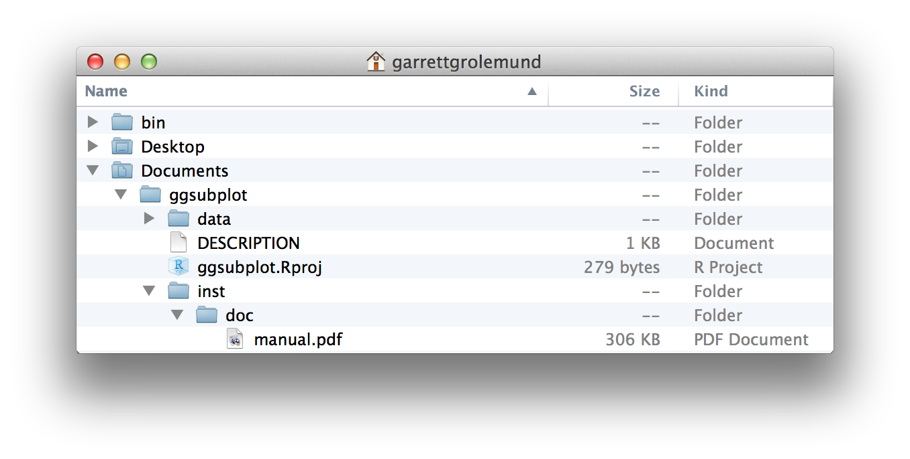
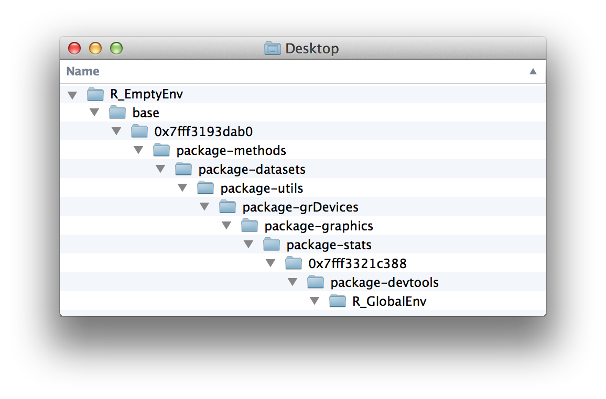
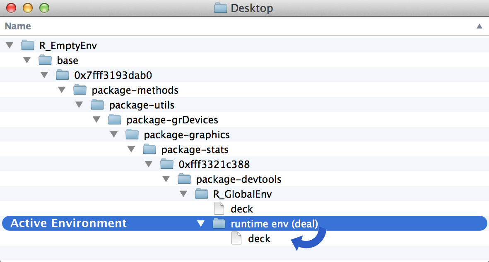
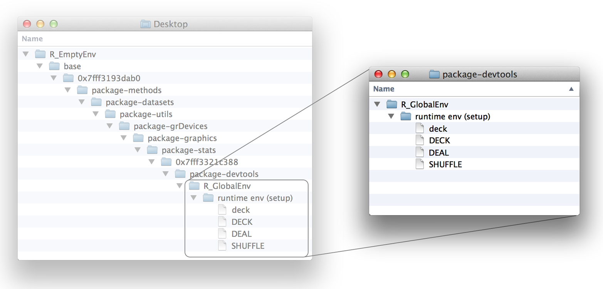

# Environments

Your deck is now ready for a game of blackjack (or hearts or war), but are your `shuffle` and `deal` functions up to snuff? Definitely not. For example, `deal` deals the same card over and over again:

```r
deal(deck)
## face   suit value
## king spades    13

deal(deck)
## face   suit value
## king spades    13

deal(deck)
## face   suit value
## king spades    13
```

And the `shuffle` function doesn't actually shuffle `deck` (it returns a copy of `deck` that has been shuffled). In short, both of these functions use `deck`, but neither manipulates `deck`—and we would like them to. 

To fix these functions, you will need to learn how R stores, looks up, and manipulates objects like `deck`. R does all of these things with the help of an environment system.

## Environments

Consider for a moment how your computer stores files. Every file is saved in a folder, and each folder is saved in another folder, which forms a hierarchical file system. If your computer wants to open up a file, it must first look up the file in this file system.

You can see your file system by opening a finder window. For example, Figure \@ref(fig:folders) shows part of the file system on my computer. I have tons of folders. Inside one of them is a subfolder named _Documents_, inside of that subfolder is a sub-subfolder named _ggsubplot_, inside of that folder is a folder named _inst_, inside of that is a folder named _doc_, and inside of that is a file named _manual.pdf_.

```{r folders, echo = FALSE, fig.cap = "Your computer arranges files into a hierarchy of folders and subfolders. To look at a file, you need to find where it is saved in the file system."}

```

R uses a similar system to save R objects. Each object is saved inside of an environment, a list-like object that resembles a folder on your computer. Each environment is connected to a _parent environment_, a higher-level environment, which creates a hierarchy of environments. 

You can see R's environment system with the `parenvs` function in the pryr package (note `parenvs` came in the pryr package when this book was first published). `parenvs(all = TRUE)` will return a list of the environments that your R session is using. The actual output will vary from session to session depending on which packages you have loaded. Here's the output from my current session:

```r
library(pryr)
parenvs(all = TRUE)
##    label                            name               
## 1  <environment: R_GlobalEnv>       ""                 
## 2  <environment: package:pryr>  "package:pryr" 
## 3  <environment: 0x7fff3321c388>    "tools:rstudio"    
## 4  <environment: package:stats>     "package:stats"    
## 5  <environment: package:graphics>  "package:graphics" 
## 6  <environment: package:grDevices> "package:grDevices"
## 7  <environment: package:utils>     "package:utils"    
## 8  <environment: package:datasets>  "package:datasets" 
## 9  <environment: package:methods>   "package:methods"  
## 10 <environment: 0x7fff3193dab0>    "Autoloads"        
## 11 <environment: base>              ""                 
## 12 <environment: R_EmptyEnv>        ""                 
```

It takes some imagination to interpret this output, so let's visualize the environments as a system of folders, Figure \@ref(fig:environments). You can think of the environment tree like this. The lowest-level environment is named `R_GlobalEnv` and is saved inside an environment named `package:pryr`, which is saved inside the environment named `0x7fff3321c388`, and so on, until you get to the final, highest-level environment, `R_EmptyEnv`. `R_EmptyEnv` is the only R environment that does not have a parent environment. 

```{r environments, echo = FALSE, fig.cap = "R stores R objects in an environment tree that resembles your computer's folder system."}

```

Remember that this example is just a metaphor. R's environments exist in your RAM memory, and not in your file system. Also, R environments aren't technically saved inside one another. Each environment is connected to a parent environment, which makes it easy to search up R's environment tree. But this connection is one-way: there's no way to look at one environment and tell what its "children" are. So you cannot search down R's environment tree. In other ways, though, R's environment system works similar to a file system.

## Working with Environments

R comes with some helper functions that you can use to explore your environment tree. First, you can refer to any of the environments in your tree with `as.environment`. `as.environment` takes an environment name (as a character string) and returns the corresponding environment:

```r
as.environment("package:stats")
## <environment: package:stats>
## attr(,"name")
## [1] "package:stats"
## attr(,"path")
## [1] "/Library/Frameworks/R.framework/Versions/3.0/Resources/library/stats"
```

Three environments in your tree also come with their own accessor functions. These are the global environment (`R_GlobalEnv`), the base environment (`base`), and the empty environment (`R_EmptyEnv`). You can refer to them with:

```r
globalenv()
## <environment: R_GlobalEnv>

baseenv()
## <environment: base>

emptyenv()
##<environment: R_EmptyEnv>
```

Next, you can look up an environment's parent with `parent.env`: 

```r
parent.env(globalenv())
## <environment: package:pryr>
## attr(,"name")
## [1] "package:pryr"
## attr(,"path")
## [1] "/Library/Frameworks/R.framework/Versions/3.0/Resources/library/pryr"
```

Notice that the empty environment is the only R environment without a parent:


```r
parent.env(emptyenv())
## Error in parent.env(emptyenv()) : the empty environment has no parent
```

You can view the objects saved in an environment with `ls` or `ls.str`. `ls` will return just the object names, but `ls.str` will display a little about each object's structure:

```r
ls(emptyenv())
## character(0)

ls(globalenv())
##  "deal"    "deck"    "deck2"   "deck3"   "deck4"   "deck5"  
##  "die"     "gender"  "hand"    "lst"     "mat"     "mil"    
##  "new"     "now"     "shuffle" "vec"  
```

The empty environment is—not surprisingly—empty; the base environment has too many objects to list here; and the global environment has some familiar faces. It is where R has saved all of the objects that you've created so far. 

```{block2, type = "rmdtip"}
RStudio's environment pane displays all of the objects in your global environment.
```

You can use R's `$` syntax to access an object in a specific environment. For example, you can access `deck` from the global environment:

```r
head(globalenv()$deck, 3)
##  face   suit value
##  king spades    13
## queen spades    12
##  jack spades    11
```

And you can use the `assign` function to save an object into a particular environment. First give `assign` the name of the new object (as a character string). Then give `assign` the value of the new object, and finally the environment to save the object in:

```r
assign("new", "Hello Global", envir = globalenv())

globalenv()$new
## "Hello Global"
```

Notice that `assign` works similar to `<-`. If an object already exists with the given name in the given environment, `assign` will overwrite it without asking for permission. This makes `assign` useful for updating objects but creates the potential for heartache.

Now that you can explore R's environment tree, let's examine how R uses it. R works closely with the environment tree to look up objects, store objects, and evaluate functions. How R does each of these tasks will depend on the current active environment.

### The Active Environment

At any moment of time, R is working closely with a single environment. R will store new objects in this environment (if you create any), and R will use this environment as a starting point to look up existing objects (if you call any). I'll call this special environment the _active environment_. The active environment is usually the global environment, but this may change when you run a function.

You can use `environment` to see the current active environment:

```r
environment()
<environment: R_GlobalEnv>
```

The global environment plays a special role in R. It is the active environment for every command that you run at the command line. As a result, any object that you create at the command line will be saved in the global environment. You can think of the global environment as your user workspace.

When you call an object at the command line, R will look for it first in the global environment. But what if the object is not there? In that case, R will follow a series of rules to look up the object.

## Scoping Rules

R follows a special set of rules to look up objects. These rules are known as R's scoping rules, and you've already met a couple of them: 

1. R looks for objects in the current active environment.
2. When you work at the command line, the active environment is the global environment. Hence, R looks up objects that you call at the command line in the global environment.

Here is a third rule that explains how R finds objects that are not in the active environment

3. When R does not find an object in an environment, R looks in the environment's parent environment, then the parent of the parent, and so on, until R finds the object or reaches the empty environment.

So, if you call an object at the command line, R will look for it in the global environment. If R can't find it there, R will look in the parent of the global environment, and then the parent of the parent, and so on, working its way up the environment tree until it finds the object, as in Figure \@ref(fig:path). If R cannot find the object in any environment, it will return an error that says the object is not found.

```{r path, echo = FALSE, fig.cap = "R will search for an object by name in the active environment, here the global environment. If R does not find the object there, it will search in the active environment's parent, and then the parent's parent, and so on until R finds the object or runs out of environments."}
knitr::include_graphics("images/hopr_0603.png")
```

```{block2, type = "rmdtip"}
Remember that functions are a type of object in R. R will store and look up functions the same way it stores and looks up other objects, by searching for them by name in the environment tree.
```

## Assignment

When you assign a value to an object, R saves the value in the active environment under the object's name. If an object with the same name already exists in the active environment, R will overwrite it.

For example, an object named `new` exists in the global environment:

```r
new
## "Hello Global"
```

You can save a new object named `new` to the global environment with this command. R will overwrite the old object as a result:

```r
new <- "Hello Active"

new
## "Hello Active"
```

This arrangement creates a quandary for R whenever R runs a function. Many functions save temporary objects that help them do their jobs. For example, the `roll` function from [Project 1: Weighted Dice] saved an object named `die` and an object named `dice`:

```r
roll <- function() {
  die <- 1:6
  dice <- sample(die, size = 2, replace = TRUE)
  sum(dice)
}
```

R must save these temporary objects in the active environment; but if R does that, it may overwrite existing objects. Function authors cannot guess ahead of time which names may already exist in your active environment. How does R avoid this risk? Every time R runs a function, it creates a new active environment to evaluate the function in.

## Evaluation

R creates a new environment _each_ time it evaluates a function. R will use the new environment as the active environment while it runs the function, and then R will return to the environment that you called the function from, bringing the function's result with it. Let's call these new environments _runtime environments_ because R creates them at runtime to evaluate functions.

We'll use the following function to explore R's runtime environments. We want to know what the environments look like: what are their parent environments, and what objects do they contain? `show_env` is designed to tell us: 

```r
show_env <- function(){
  list(ran.in = environment(), 
    parent = parent.env(environment()), 
    objects = ls.str(environment()))
}
```

`show_env` is itself a function, so when we call `show_env()`, R will create a runtime environment to evaluate the function in. The results of `show_env` will tell us the name of the runtime environment, its parent, and which objects the runtime environment contains:

```r
show_env()
## $ran.in
## <environment: 0x7ff711d12e28>
## 
## $parent
## <environment: R_GlobalEnv>
## 
## $objects
```

The results reveal that R created a new environment named `0x7ff711d12e28` to run `show_env()` in. The environment had no objects in it, and its parent was the `global environment`. So for purposes of running `show_env`, R's environment tree looked like Figure \@ref(fig:tree).

Let's run `show_env` again:

```r
show_env()
## $ran.in
## <environment: 0x7ff715f49808>
## 
## $parent
## <environment: R_GlobalEnv>
## 
## $objects
```

This time `show_env` ran in a new environment, `0x7ff715f49808`.  R creates a new environment _each_ time you run a function. The `0x7ff715f49808` environment looks exactly the same as `0x7ff711d12e28`. It is empty and has the same global environment as its parent.

```{r tree, echo = FALSE, fig.cap = "R creates a new environment to run show_env in. The environment is a child of the global environment."}
knitr::include_graphics("images/hopr_0604.png")
```

Now let's consider which environment R will use as the parent of the runtime environment. 

R will connect a function's runtime environment to the environment that the function _was first created in_. This environment plays an important role in the function's life—because all of the function's runtime environments will use it as a parent. Let's call this environment the _origin environment_. You can look up a function's origin environment by running `environment` on the function:

```r
environment(show_env)
## <environment: R_GlobalEnv>
```

The origin environment of `show_env` is the global environment because we created `show_env` at the command line, but the origin environment does not need to be the global environment. For example, the environment of `parenvs` is the `pryr` package: 


```r
environment(parenvs)
## <environment: namespace:pryr>
```

In other words, the parent of a runtime environment will not always be the global environment; it will be whichever environment the function was first created in.

Finally, let's look at the objects contained in a runtime environment. At the moment, `show_env`'s runtime environments do not contain any objects, but that is easy to fix. Just have `show_env` create some objects in its body of code. R will store any objects created by `show_env` in its runtime environment. Why? Because the runtime environment will be the active environment when those objects are created: 

```r
show_env <- function(){
  a <- 1
  b <- 2
  c <- 3
  list(ran.in = environment(), 
    parent = parent.env(environment()), 
    objects = ls.str(environment()))
}
```

This time when we run `show_env`, R stores `a`, `b`, and `c` in the runtime environment:

```r
show_env()
## $ran.in
## <environment: 0x7ff712312cd0>
## 
## $parent
## <environment: R_GlobalEnv>
## 
## $objects
## a :  num 1
## b :  num 2
## c :  num 3
```

This is how R ensures that a function does not overwrite anything that it shouldn't. Any objects created by the function are stored in a safe, out-of-the-way runtime environment.

R will also put a second type of object in a runtime environment. If a function has arguments, R will copy over each argument to the runtime environment. The argument will appear as an object that has the name of the argument but the value of whatever input the user provided for the argument. This ensures that a function will be able to find and use each of its arguments:

```r
foo <- "take me to your runtime"

show_env <- function(x = foo){
  list(ran.in = environment(), 
    parent = parent.env(environment()), 
    objects = ls.str(environment()))
}

show_env()
## $ran.in
## <environment: 0x7ff712398958>
## 
## $parent
## <environment: R_GlobalEnv>
## 
## $objects
## x :  chr "take me to your runtime"
```

Let's put this all together to see how R evaluates a function. Before you call a function, R is working in an active environment; let's call this the _calling environment_. It is the environment R calls the function from. 

Then you call the function. R responds by setting up a new runtime environment. This environment will be a child of the function's origin enviornment. R will copy each of the function's arguments into the runtime environment and then make the runtime environment the new active environment. 

Next, R runs the code in the body of the function. If the code creates any objects, R stores them in the active, that is, runtime environment. If the code calls any objects, R uses its scoping rules to look them up. R will search the runtime environment, then the parent of the runtime environment (which will be the origin environment), then the parent of the origin environment, and so on. Notice that the calling environment might not be on the search path. Usually, a function will only call its arguments, which R can find in the active runtime environment. 

Finally, R finishes running the function. It switches the active environment back to the calling environment. Now R executes any other commands in the line of code that called the function. So if you save the result of the function to an object with `<-`, the new object will be stored in the calling environment.

To recap, R stores its objects in an environment system. At any moment of time, R is working closely with a single active environment. It stores new objects in this environment, and it uses the environment as a starting point when it searches for existing objects. R's active environment is usually the global environment, but R will adjust the active environment to do things like run functions in a safe manner.

How can you use this knowledge to fix the `deal` and `shuffle` functions?

First, let's start with a warm-up question. Suppose I redefine `deal` at the command line like this:

```r
deal <- function() {
  deck[1, ]
}
```

Notice that `deal` no longer takes an argument, and it calls the `deck` object, which lives in the global environment.

```{exercise, name = "Will deal work?"}
Will R be able to find `deck` and return an answer when I call the new version of `deal`, such as `deal()`?
```

```{solution}
Yes. `deal` will still work the same as before. R will run `deal` in a runtime environment that is a child of the global environment. Why will it be a child of the global environment? Because the global environment is the origin environment of `deal` (we defined `deal` in the global environment):
```

```r
environment(deal)
## <environment: R_GlobalEnv>
```

When `deal` calls `deck`, R will need to look up the `deck` object. R's scoping rules will lead it to the version of `deck` in the global environment, as in Figure \@ref(fig:deal). `deal` works as expected as a result:

```r
deal()
##  face   suit value
##  king spades    13
```

```{r deal, echo = FALSE, fig.cap = "R finds deck by looking in the parent of deal's runtime environment. The parent is the global environment, deal's origin environment. Here, R finds the copy of deck."}
knitr::include_graphics("images/hopr_0605.png")
```

Now let's fix the `deal` function to remove the cards it has dealt from `deck`. Recall that `deal` returns the top card of `deck` but does not remove the card from the deck. As a result, `deal` always returns the same card:

```r
deal()
##  face   suit value
##  king spades    13

deal()
##  face   suit value
##  king spades    13
```

You know enough R syntax to remove the top card of `deck`. The following code will save a prisitine copy of `deck` and then remove the top card:

```r
DECK <- deck

deck <- deck[-1, ]

head(deck, 3)
##  face   suit value
## queen spades    12
##  jack spades    11
##   ten spades    10
```

Now let's add the code to `deal`. Here `deal` saves (and then returns) the top card of `deck`. In between, it removes the card from `deck`...or does it?

```r
deal <- function() {
  card <- deck[1, ]
  deck <- deck[-1, ]
  card
}
```

This code won't work because R will be in a runtime environment when it executes `deck <- deck[-1, ]`. Instead of overwriting the global copy of `deck` with `deck[-1, ]`, `deal` will just create a slightly altered copy of `deck` in its runtime environment, as in Figure \@ref(fig:second-deck).

```{r second-deck, echo = FALSE, fig.cap = "The deal function looks up deck in the global environment but saves deck[-1, ] in the runtime environment as a new object named deck. "}

```

```{exercise, name = "Overwrite deck"}
Rewrite the `deck <- deck[-1, ]` line of `deal` to _assign_ `deck[-1, ]` to an object named `deck` in the global environment. Hint: consider the `assign` function.
```

```{solution}
You can assign an object to a specific environment with the `assign` function: 
```

```r
deal <- function() {
  card <- deck[1, ]
  assign("deck", deck[-1, ], envir = globalenv())
  card
}
```

Now `deal` will finally clean up the global copy of `deck`, and we can `deal` cards just as we would in real life:

```r
deal()
##  face   suit value
## queen spades    12

deal()
## face   suit value
## jack spades    11

deal()
## face   suit value
##  ten spades    10
```

Let's turn our attention to the `shuffle` function:

```r
shuffle <- function(cards) { 
  random <- sample(1:52, size = 52)
  cards[random, ]
}
```

`shuffle(deck)` doesn't shuffle the `deck` object; it returns a shuffled copy of the `deck` object:

```r
head(deck, 3)
##  face   suit value
##  nine spades     9
## eight spades     8
## seven spades     7

a <- shuffle(deck)

head(deck, 3)
##  face   suit value
##  nine spades     9
## eight spades     8
## seven spades     7

head(a, 3)
##  face     suit value
##   ace diamonds     1
## seven    clubs     7
##   two    clubs     2
```

This behavior is now undesirable in two ways. First, `shuffle` fails to shuffle `deck`. Second, `shuffle` returns a copy of `deck`, which may be missing the cards that have been dealt away. It would be better if `shuffle` returned the dealt cards to the deck and then shuffled. This is what happens when you shuffle a deck of cards in real life. 

```{exercise, name = "Rewrite shuffle"}
Rewrite `shuffle` so that it replaces the copy of `deck` that lives in the global environment with a shuffled version of `DECK`, the intact copy of `deck` that also lives in the global environment. The new version of `shuffle` should have no arguments and return no output.
```

```{solution}
You can update `shuffle` in the same way that you updated `deck`. The following version will do the job: 
```

```r
shuffle <- function(){
  random <- sample(1:52, size = 52)
  assign("deck", DECK[random, ], envir = globalenv())
}
```

Since `DECK` lives in the global environment, `shuffle`'s environment of origin, `shuffle` will be able to find `DECK` at runtime. R will search for `DECK` first in `shuffle`'s runtime environment, and then in `shuffle`'s origin environment—the global environment—which is where `DECK` is stored.

The second line of `shuffle` will create a reordered copy of `DECK` and save it as `deck` in the global environment. This will overwrite the previous, nonshuffled version of `deck`.

## Closures

Our system finally works. For example, you can shuffle the cards and then deal a hand of blackjack: 

```r
shuffle()

deal()
##  face   suit value
## queen hearts    12

deal()
##  face   suit value
## eight hearts     8
```

But the system requires `deck` and `DECK` to exist in the global environment. Lots of things happen in this environment, and it is possible that `deck` may get modified or erased by accident. 

It would be better if we could store `deck` in a safe, out-of-the-way place, like one of those safe, out-of-the-way environments that R creates to run functions in. In fact, storing `deck` in a runtime environment is not such a bad idea.

You could create a function that takes `deck` as an argument and saves a copy of `deck` as `DECK`. The function could also save its own copies of `deal` and `shuffle`:

```r
setup <- function(deck) {
  DECK <- deck

  DEAL <- function() {
    card <- deck[1, ]
    assign("deck", deck[-1, ], envir = globalenv())
    card
  }

  SHUFFLE <- function(){
    random <- sample(1:52, size = 52)
    assign("deck", DECK[random, ], envir = globalenv())
 }
}
```

When you run `setup`, R will create a runtime environment to store these objects in. The environment will look like Figure \@ref(fig:closure1).

Now all of these things are safely out of the way in a child of the global environment. That makes them safe but hard to use. Let's ask `setup` to return `DEAL` and `SHUFFLE` so we can use them. The best way to do this is to return the functions as a list:


```r
setup <- function(deck) {
  DECK <- deck

  DEAL <- function() {
    card <- deck[1, ]
    assign("deck", deck[-1, ], envir = globalenv())
    card
  }

  SHUFFLE <- function(){
    random <- sample(1:52, size = 52)
    assign("deck", DECK[random, ], envir = globalenv())
 }

 list(deal = DEAL, shuffle = SHUFFLE)
}

cards <- setup(deck)
```


```{r closure1, echo = FALSE, fig.cap = "Running setup will store deck and DECK in an out-of-the-way place, and create a DEAL and SHUFFLE function. Each of these objects will be stored in an environment whose parent is the global environment."}

```

Then you can save each of the elements of the list to a dedicated object in the global environment:

```r
deal <- cards$deal
shuffle <- cards$shuffle
```

Now you can run `deal` and `shuffle` just as before. Each object contains the same code as the original `deal` and `shuffle`:

```r
deal
## function() {
##     card <- deck[1, ]
##     assign("deck", deck[-1, ], envir = globalenv())
##     card
##   }
## <environment: 0x7ff7169c3390>

shuffle
## function(){
##     random <- sample(1:52, size = 52)
##     assign("deck", DECK[random, ], envir = globalenv())
##  }
## <environment: 0x7ff7169c3390>
```

However, the functions now have one important difference. Their origin environment is no longer the global environment (although `deal` and `shuffle` _are_ currently saved there). Their origin environment is the runtime environment that R made when you ran `setup`. That's where R created `DEAL` and `SHUFFLE`, the functions copied into the new `deal` and `shuffle`, as shown in: 

```r
environment(deal)
## <environment: 0x7ff7169c3390>

environment(shuffle)
## <environment: 0x7ff7169c3390>
```

Why does this matter? Because now when you run `deal` or `shuffle`, R will evaluate the functions in a runtime environment that uses `0x7ff7169c3390` as its parent. `DECK` and `deck` will be in this parent environment, which means that `deal` and `shuffle` will be able to find them at runtime. `DECK` and `deck` will be in the functions' search path but still out of the way in every other respect, as shown in Figure \@ref(fig:closure2).

```{r closure2, echo = FALSE, fig.cap = "Now deal and shuffle will be run in an environment that has the protected deck and DECK in its search path."}
knitr::include_graphics("images/hopr_0608.png")
```

This arrangement is called a _closure_. `setup`'s runtime environment "encloses" the `deal` and `shuffle` functions. Both `deal` and `shuffle` can work closely with the objects contained in the enclosing environment, but almost nothing else can. The enclosing environment is not on the search path for any other R function or environment.

You may have noticed that `deal` and `shuffle` still update the `deck` object in the global environment. Don't worry, we're about to change that. We want `deal` and `shuffle` to work exclusively with the objects in the parent (enclosing) environment of their runtime environments. Instead of having each function reference the global environment to update `deck`, you can have them reference their parent environment at runtime, as shown in Figure \@ref(fig:closure3):

```r
setup <- function(deck) {
  DECK <- deck

  DEAL <- function() {
    card <- deck[1, ]
    assign("deck", deck[-1, ], envir = parent.env(environment()))
    card
  }

  SHUFFLE <- function(){
    random <- sample(1:52, size = 52)
    assign("deck", DECK[random, ], envir = parent.env(environment()))
 }

 list(deal = DEAL, shuffle = SHUFFLE)
}

cards <- setup(deck)
deal <- cards$deal
shuffle <- cards$shuffle
```


```{r closure3, echo = FALSE, fig.cap = "When you change your code, deal and shuffle will go from updating the global environment (left) to updating their parent environment (right)."}
knitr::include_graphics("images/hopr_0609.png")
```

We finally have a self-contained card game. You can delete (or modify) the global copy of `deck` as much as you want and still play cards. `deal` and `shuffle` will use the pristine, protected copy of `deck`:

```r
rm(deck)

shuffle()

deal()
## face   suit value
##  ace hearts     1

deal()
## face  suit value
## jack clubs    11
```

Blackjack!


## Summary

R saves its objects in an environment system that resembles your computer's file system. If you understand this system, you can predict how R will look up objects. If you call an object at the command line, R will look for the object in the global environment and then the parents of the global environment, working its way up the environment tree one environment at a time. 

R will use a slightly different search path when you call an object from inside of a function. When you run a function, R creates a new environment to execute commands in. This environment will be a child of the environment where the function was originally defined. This may be the global environment, but it also may not be.  You can use this behavior to create closures, which are functions linked to objects in protected environments.

As you become familiar with R's environment system, you can use it to produce elegant results, like we did here. However, the real value of understanding the environment system comes from knowing how R functions do their job. You can use this knowledge to figure out what is going wrong when a function does not perform as expected.

## Project 2 Wrap-up

You now have full control over the data sets and values that you load into R. You can store data as R objects, you can retrieve and manipulate data values at will, and you can even predict how R will store and look up your objects in your computer's memory.

You may not realize it yet, but your expertise makes you a powerful, computer-augmented data user. You can use R to save and work with larger data sets than you could otherwise handle. So far we've only worked with `deck`, a small data set; but you can use the same techniques to work with any data set that fits in your computer's memory.

However, storing data is not the only logistical task that you will face as a data scientist. You will often want to do tasks with your data that are so complex or repetitive that they are difficult to do without a computer. Some of the things can be done with functions that already exist in R and its packages, but others cannot. You will be the most versatile as a data scientist if you can write your own programs for computers to follow. R can help you do this. When you are ready, [Project 3: Slot Machine] will teach you the most useful skills for writing programs in R.
