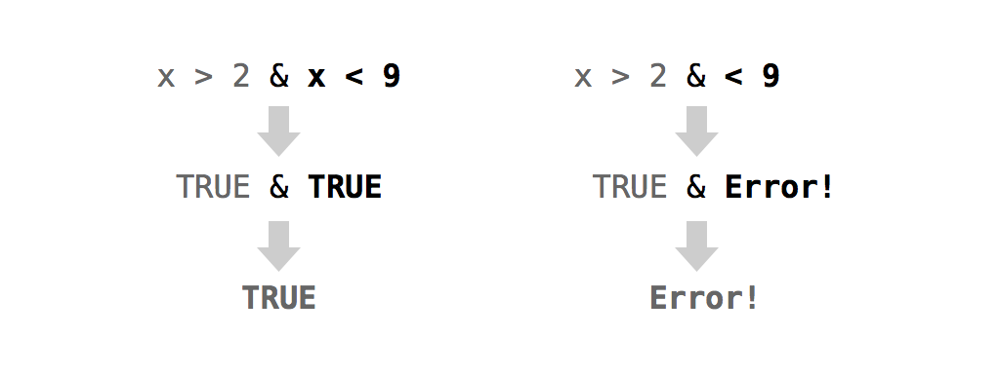

# Modifying Values {#modify}

Are you ready to play some games with your virtual deck? Not so fast! The point system in your deck of cards doesn't align well with many card games. For example, in war and poker, aces are usually scored higher than kings. They'd have a point value of 14, not 1. 

In this task, you will change the point system of your deck three times to match three different games: war, hearts, and blackjack. Each of these games will teach you something different about modifying the values inside of a data set. Start by making a copy of `deck` that you can manipulate. This will ensure that you always have a pristine copy of `deck` to fall back on (should things go awry):

```r
deck2 <- deck
```
### Changing Values in Place

You can use R's notation system to modify values within an R object. First, describe the value (or values) you wish to modify. Then use the assignment operator `<-` to overwrite those values. R will update the selected values _in the original object_. Let's put this into action with a real example:

```r
vec <- c(0, 0, 0, 0, 0, 0)
vec
##  0 0 0 0 0 0
```

Here's how you can select the first value of `vec`:

```r
vec[1]
##  0
```

And here is how you can modify it:

```r
vec[1] <- 1000
vec
## 1000    0    0    0    0    0
```

You can replace multiple values at once as long as the number of new values equals the number of selected values:

```r
vec[c(1, 3, 5)] <- c(1, 1, 1)
vec
##  1 0 1 0 1 0

vec[4:6] <- vec[4:6] + 1
vec
## 1 0 1 1 2 1
```

You can also create values that do not yet exist in your object. R will expand the object to accommodate the new values: 

```r
vec[7] <- 0
vec
## 1 0 1 1 2 1 0
```

This provides a great way to add new variables to your data set:

```r
deck2$new <- 1:52

head(deck2)
##   face   suit value new
##   king spades    13   1
##  queen spades    12   2
##   jack spades    11   3
##    ten spades    10   4
##   nine spades     9   5
##  eight spades     8   6
```

You can also remove columns from a data frame (and elements from a list) by assigning them the symbol `NULL`:

```r
deck2$new <- NULL

head(deck2)
##   face   suit value
##   king spades    13
##  queen spades    12
##   jack spades    11
##    ten spades    10
##   nine spades     9
##  eight spades     8
```

In the game of war, aces are king (figuratively speaking). They receive the highest value of all the cards, which would be something like 14. Every other card gets the value that it already has in `deck`. To play war, you just need to change the values of your aces from 1 to 14.

As long as you haven't shuffled your deck, you know just where the aces are. They appear every 13 cards. Hence, you can describe them with R's notation system:

```r
deck2[c(13, 26, 39, 52), ]
##  face     suit value
##   ace   spades     1
##   ace    clubs     1
##   ace diamonds     1
##   ace   hearts     1
```

You can single out just the _values_ of the aces by subsetting the columns dimension of `deck2`. Or, even better, you can subset the column vector `deck2$value`:

```r
deck2[c(13, 26, 39, 52), 3]
## 1 1 1 1

deck2$value[c(13, 26, 39, 52)]
## 1 1 1 1
```

Now all you have to do is assign a new set of values to these old values. The set of new values will have to be the same size as the set of values that you are replacing. So you could save `c(14, 14, 14, 14)` into the ace values, or you could just save *`14`* and rely on R's recycling rules to expand `14` to `c(14, 14, 14, 14)`:

```r
deck2$value[c(13, 26, 39, 52)] <- c(14, 14, 14, 14)

# or

deck2$value[c(13, 26, 39, 52)] <- 14
```

Notice that the values change _in place_. You don't end up with a modified _copy_ of `deck2`; the new values will appear inside `deck2`: 

```r
head(deck2, 13)
##   face   suit value
##   king spades    13
##  queen spades    12
##   jack spades    11
##    ten spades    10
##   nine spades     9
##  eight spades     8
##  seven spades     7
##    six spades     6
##   five spades     5
##   four spades     4
##  three spades     3
##    two spades     2
##    ace spades    14
```

The same technique will work whether you store your data in a vector, matrix, array, list, or data frame. Just describe the values that you want to change with R's notation system, then assign over those values with R's assignment operator.

Things worked very easily in this example because you knew exactly where each ace was. The cards were sorted in an orderly manner and an ace appeared every 13 rows. 

But what if the deck had been shuffled? You could look through all the cards and note the locations of the aces, but that would be tedious. If your data frame were larger, it might be impossible: 

```r
deck3 <- shuffle(deck)
```

Where are the aces now?

```r
head(deck3)
##  face     suit value
## queen    clubs    12
##  king    clubs    13
##   ace   spades     1   # an ace
##  nine    clubs     9
## seven   spades     7
## queen diamonds    12
```

Why not ask R to find the aces for you? You can do this with logical subsetting. Logical subsetting provides a way to do targeted extraction and modification with R objects, a sort of search-and-destroy mission inside your own data sets. 

### Logical Subsetting

Do you remember R's logical index system, [logicals](#logicals)? To recap, you can select values with a vector of `TRUE`s and `FALSE`s. The vector must be the same length as the dimension that you wish to subset. R will return every element that matches a TRUE:

```r
vec
## 1 0 1 1 2 1 0

vec[c(FALSE, FALSE, FALSE, FALSE, TRUE, FALSE, FALSE)]
## 2
```

At first glance, this system might seem impractical. Who wants to type out long vectors of TRUEs and FALSEs? No one. But you don't have to. You can let a logical test create a vector of TRUEs and FALSEs for you.

#### Logical Tests

A logical test is a comparison like "is one less than two?", `1 < 2`, or "is three greater than four?", `3 > 4`. R provides seven logical operators that you can use to make comparisons, shown in Table \@ref(tab:logop). 

Table: (\#tab:logop) R's Logical Operators

|Operator|Syntax|Tests
|--------|------|-----
|`>`|`a > b`|Is a greater than b?
|`>=`|`a >= b`|Is a greater than or equal to b?
|`<`|`a < b`|Is a less than b?
|`<=`|`a <= b`|Is a less than or equal to b?
|`==`|`a ## b`|Is a equal to b?
|`!=`|`a != b`|Is a not equal to b?
|`%in%`|`a %in% c(a, b, c)`|Is a in the group c(a, b, c)? 

Each operator returns a `TRUE` or a `FALSE`. If you use an operator to compare vectors, R will do element-wise comparisons—just like it does with the arithmetic operators:

```r
1 > 2
## FALSE

1 > c(0, 1, 2)
## TRUE FALSE FALSE

c(1, 2, 3) ## c(3, 2, 1)
## FALSE  TRUE FALSE
```

`%in%` is the only operator that does not do normal element-wise execution. `%in%` tests whether the value(s) on the left side are in the vector on the right side. If you provide a vector on the left side, `%in%` will _not_ pair up the values on the left with the values on the right and then do element-wise tests. Instead, `%in%` will independently test whether each value on the left is _somewhere_ in the vector on the right: 

```r
1 %in% c(3, 4, 5)
## FALSE

c(1, 2) %in% c(3, 4, 5)
## FALSE FALSE

c(1, 2, 3) %in% c(3, 4, 5)
## FALSE FALSE  TRUE

c(1, 2, 3, 4) %in% c(3, 4, 5)
## FALSE FALSE  TRUE  TRUE
```

Notice that you test for equality with a double equals sign, `==`, and not a single equals sign, `=`, which is another way to write `<-`. It is easy to forget and use `a = b` to test if `a` equals `b`. Unfortunately, you'll be in for a nasty surprise. R won't return a `TRUE` or `FALSE`, because it won't have to: `a` _will_ equal `b`, because you just ran the equivalent of `a <- b`.

```{block2, type = "rmdwarning"}
**`=` is an assignment operator**

Be careful not to confuse `=` with `==`. `=` does the same thing as `<-`: it assigns a value to an object. 
```

You can compare any two R objects with a logical operator; however, logical operators make the most sense if you compare two objects of the same data type. If you compare objects of different data types, R will use its coercion rules to coerce the objects to the same type before it makes the comparison.

```{exercise, name = "How many Aces?"}
Extract the `face` column of `deck2` and test whether each value is equal to `ace`. As a challenge, use R to quickly count how many cards are equal to `ace`.
```
  
```{solution}
You can extract the `face` column with R's `$` notation:
```

```r
deck2$face
##  "king"  "queen" "jack"  "ten"   "nine" 
##  "eight" "seven" "six"   "five"  "four" 
##  "three" "two"   "ace"   "king"  "queen"
##  "jack"  "ten"   "nine"  "eight" "seven"
##  "six"   "five"  "four"  "three" "two"  
##  "ace"   "king"  "queen" "jack"  "ten"  
##  "nine"  "eight" "seven" "six"   "five" 
##  "four"  "three" "two"   "ace"   "king" 
##  "queen" "jack"  "ten"   "nine"  "eight"
##  "seven" "six"   "five"  "four"  "three"
##  "two"   "ace"
```

Next, you can use the `==` operator to test whether each value is equal to `ace`. In the following code, R will use its recycling rules to indivuidually compare every value of `deck2$face` to `"ace"`. Notice that the quotation marks are important. If you leave them out, R will try to find an object named `ace` to compare against `deck2$face`:

```r
deck2$face ## "ace"
##  FALSE FALSE FALSE FALSE FALSE FALSE FALSE
##  FALSE FALSE FALSE FALSE FALSE  TRUE FALSE
##  FALSE FALSE FALSE FALSE FALSE FALSE FALSE
##  FALSE FALSE FALSE FALSE  TRUE FALSE FALSE
##  FALSE FALSE FALSE FALSE FALSE FALSE FALSE
##  FALSE FALSE FALSE  TRUE FALSE FALSE FALSE
##  FALSE FALSE FALSE FALSE FALSE FALSE FALSE
##  FALSE FALSE  TRUE
```

You can use `sum` to quickly count the number of `TRUE`s in the previous vector. Remember that R will coerce logicals to numerics when you do math with them. R will turn `TRUE`s into ones and `FALSE`s into zeroes. As a result, sum will count the number of `TRUE`s:

```r
sum(deck2$face ## "ace")
## 4
```

You can use this method to spot and then change the aces in your deck—even if you've shuffled your cards. First, build a logical test that identifies the aces in your shuffled deck:

```r
deck3$face ## "ace"
```

Then use the test to single out the ace point values. Since the test returns a logical vector, you can use it as an index:

```r
deck3$value[deck3$face ## "ace"]
##  1 1 1 1
```

Finally, use assignment to change the ace values in `deck3`:

```r
deck3$value[deck3$face ## "ace"] <- 14

head(deck3)
##  face     suit value
## queen    clubs    12
##  king    clubs    13
##   ace   spades    14  # an ace
##  nine    clubs     9
## seven   spades     7
## queen diamonds    12
```

To summarize, you can use a logical test to select values within an object.

Logical subsetting is a powerful technique because it lets you quickly identify, extract, and modify individual values in your data set. When you work with logical subsetting, you do not need to know _where_ in your data set a value exists. You only need to know how to describe the value with a logical test. 

Logical subsetting is one of the things R does best. In fact, logical subsetting is a key component of vectorized programming, a coding style that lets you write fast and efficient R code, which we will study in [Speed].

Let's put logical subsetting to use with a new game: hearts. In hearts, every card has a value of zero:

```r
deck4 <- deck
deck4$value <- 0

head(deck4, 13)
##   face   suit value
##   king spades     0
##  queen spades     0
##   jack spades     0
##    ten spades     0
##   nine spades     0
##  eight spades     0
##  seven spades     0
##    six spades     0
##   five spades     0
##   four spades     0
##  three spades     0
##    two spades     0
##    ace spades     0
```

except cards in the suit of hearts and the queen of spades. Each card in the suit of hearts has a value of 1. Can you find these cards and replace their values? Give it a try.

```{exercise, name = "Score the Deck for Hearts"}
Assign a value of `1` to every card in `deck4` that has a suit of hearts.
```

```{solution}
To do this, first write a test that identifies cards in the `hearts` suit:
```

```r
deck4$suit ## "hearts"
##  FALSE FALSE FALSE FALSE FALSE FALSE FALSE
##  FALSE FALSE FALSE FALSE FALSE FALSE FALSE
##  FALSE FALSE FALSE FALSE FALSE FALSE FALSE
##  FALSE FALSE FALSE FALSE FALSE FALSE FALSE
##  FALSE FALSE FALSE FALSE FALSE FALSE FALSE
##  FALSE FALSE FALSE FALSE  TRUE  TRUE  TRUE
##   TRUE  TRUE  TRUE  TRUE  TRUE  TRUE  TRUE
##   TRUE  TRUE  TRUE
```

Then use your test to select the values of these cards:

```r
deck4$value[deck4$suit ## "hearts"]
## 0 0 0 0 0 0 0 0 0 0 0 0 0
```

Finally, assign a new number to these values:

```r
deck4$value[deck4$suit ## "hearts"] <- 1
```

Now all of your `hearts` cards have been updated:

```r
deck4$value[deck4$suit ## "hearts"]
## 1 1 1 1 1 1 1 1 1 1 1 1 1
```

In hearts, the queen of spades has the most unusual value of all: she's worth 13 points. It should be simple to change her value, but she's surprisingly hard to find. You could find all of the _queens_:

```r
deck4[deck4$face ## "queen", ]
##   face     suit value
##  queen   spades     0
##  queen    clubs     0
##  queen diamonds     0
##  queen   hearts     1
```

But that's three cards too many. On the other hand, you could find all of the cards in _spades_: 

```r
deck4[deck4$suit ## "spades", ]
##   face   suit value
##   king spades     0
##  queen spades     0
##   jack spades     0
##    ten spades     0
##   nine spades     0
##  eight spades     0
##  seven spades     0
##    six spades     0
##   five spades     0
##   four spades     0
##  three spades     0
##    two spades     0
##    ace spades     0
```

But that's 12 cards too many. What you really want to find is all of the cards that have both a face value equal to queen and a suit value equal to spades. You can do that with a _Boolean operator_. Boolean operators combine multiple logical tests together into a single test.

#### Boolean Operators

Boolean operators are things like _and_ (`&`) and _or_ (`|`). They collapse the results of multiple logical tests into a single `TRUE` or `FALSE`. R has six boolean operators, shown in Table \@ref(tab:boole).

Table: (\#tab:boole) Boolean operators

|Operator|Syntax|Tests
|--------|------|-----
|`&`|`cond1 & cond2`|Are both `cond1` and `cond2` true?
|`\|`|`cond1 pipe cond2`|Is one or more of `cond1` and `cond2` true?
|`xor`|`xor(cond1, cond2)`|Is exactly one of `cond1` and `cond2` true?
|`!`|`!cond1`|Is `cond1` false? (e.g., `!` flips the results of a logical test)
|`any`|`any(cond1, cond2, cond3, ...)`|Are any of the conditions true?
|`all`|`all(cond1, cond2, cond3, ...)`|Are all of the conditions true?

To use a Boolean operator, place it between two _complete_ logical tests. R will execute each logical test and then use the Boolean operator to combine the results into a single `TRUE` or `FALSE`, Figure \@ref(fig:boolean). 

```{block2, type = "rmdwarning"}
**The most common mistake with Boolean operators**
  
It is easy to forget to put a complete test on either side of a Boolean operator. In English, it is efficient to say "Is _x_ greater than two and less than nine?" But in R, you need to write the equivalent of "Is _x_ greater than two and _is x_ less than nine?" This is shown in Figure \@ref(fig:boolean).
```

```{r boolean, echo = FALSE, fig.cap = "R will evaluate the expressions on each side of a Boolean operator separately, and then combine the results into a single TRUE or FALSE. If you do not supply a complete test to each side of the operator, R will return an error."}

```

When used with vectors, Boolean operators will follow the same element-wise execution as arithmetic and logical operators:

```r
a <- c(1, 2, 3)
b <- c(1, 2, 3)
c <- c(1, 2, 4)

a ## b
##  TRUE TRUE TRUE

b ## c
##  TRUE  TRUE FALSE

a ## b & b ## c
##  TRUE  TRUE FALSE
```

Could you use a Boolean operator to locate the queen of spades in your deck? Of course you can. You want to test each card to see if it is both a queen _and_ a spade. You can write this test in R with:

```r
deck4$face ## "queen" & deck4$suit ## "spades"
##  FALSE  TRUE FALSE FALSE FALSE FALSE FALSE
##  FALSE FALSE FALSE FALSE FALSE FALSE FALSE
##  FALSE FALSE FALSE FALSE FALSE FALSE FALSE
##  FALSE FALSE FALSE FALSE FALSE FALSE FALSE
##  FALSE FALSE FALSE FALSE FALSE FALSE FALSE
##  FALSE FALSE FALSE FALSE FALSE FALSE FALSE
##  FALSE FALSE FALSE FALSE FALSE FALSE FALSE
##  FALSE FALSE FALSE
```

I'll save the results of this test to its own object. That will make the results easier to work with:

```r
queenOfSpades <- deck4$face ## "queen" & deck4$suit ## "spades"
```

Next, you can use the test as an index to select the value of the queen of spades. Make sure the test actually selects the correct value: 

```r
deck4[queenOfSpades, ]
##  face   suit value
## queen spades     0

deck4$value[queenOfSpades]
## 0
```

Now that you've found the queen of spades, you can update her value:

```r
deck4$value[queenOfSpades] <- 13

deck4[queenOfSpades, ]
##  face   suit value
## queen spades     13
```

Your deck is now ready to play hearts.

```{exercise, name = "Practice with Tests"}
If you think you have the hang of logical tests, try converting these sentences into tests written with R code. To help you out, I've defined some R objects after the sentences that you can use to test your answers: 

* Is w positive?
* Is x greater than 10 and less than 20?
* Is object y the word February?
* Is _every_ value in z a day of the week?
```

```r
w <- c(-1, 0, 1)
x <- c(5, 15)
y <- "February"
z <- c("Monday", "Tuesday", "Friday")
```

```{solution}
Here are some model answers. If you got stuck, be sure to re-read how R evaluates logical tests that use Boolean values:
```

```r
w > 0
10 < x & x < 20
y ## "February"
all(z %in% c("Monday", "Tuesday", "Wednesday", "Thursday", "Friday", 
  "Saturday", "Sunday"))
```

Let's consider one last game, blackjack. In blackjack, each number card has a value equal to its face value. Each face card (king, queen, or jack) has a value of 10. Finally, each ace has a value of 11 or 1, depending on the final results of the game. 

Let's begin with a fresh copy of `deck`—that way the number cards (`two` through `ten`) will start off with the correct value:

```r
deck5 <- deck

head(deck5, 13)
##   king spades    13
##  queen spades    12
##   jack spades    11
##    ten spades    10
##   nine spades     9
##  eight spades     8
##  seven spades     7
##    six spades     6
##   five spades     5
##   four spades     4
##  three spades     3
##    two spades     2
##    ace spades     1
```

You can change the value of the face cards in one fell swoop with `%in%`:

```r
facecard <- deck5$face %in% c("king", "queen", "jack")

deck5[facecard, ]
##   face     suit value
##   king   spades    13
##  queen   spades    12
##   jack   spades    11
##   king    clubs    13
##  queen    clubs    12
##   jack    clubs    11
##   king diamonds    13
##  queen diamonds    12
##   jack diamonds    11
##   king   hearts    13
##  queen   hearts    12
##   jack   hearts    11

deck5$value[facecard] <- 10

head(deck5, 13)
##   face   suit value
##   king spades    10
##  queen spades    10
##   jack spades    10
##    ten spades    10
##   nine spades     9
##  eight spades     8
##  seven spades     7
##    six spades     6
##   five spades     5
##   four spades     4
##  three spades     3
##    two spades     2
##    ace spades     1
```

Now you just need to fix the ace values—or do you? It is hard to decide what value to give the aces because their exact value will change from hand to hand. At the end of each hand, an ace will equal 11 if the sum of the player's cards does not exceed 21. Otherwise, the ace will equal 1. The actual value of the ace will depend on the other cards in the player's hand. This is a case of missing information. At the moment, you do not have enough information to assign a correct point value to the ace cards.

### Missing Information {#missing}

Missing information problems happen frequently in data science. Usually, they are more straightforward: you don't know a value because the measurement was lost, corrupted, or never taken to begin with. R has a way to help you manage these missing values.

The `NA` character is a special symbol in R. It stands for "not available" and can be used as a placeholder for missing information. R will treat NA exactly as you should want missing information treated. For example, what result would you expect if you add 1 to a piece of missing information?

```r
1 + NA
## NA
```

R will return a second piece of missing information. It would not be correct to say that `1 + NA = 1` because there is a good chance that the missing quantity is not zero. You do not have enough information to determine the result.

What if you tested whether a piece of missing information is equal to 1?

```r
NA ## 1
## NA
```

Again, your answer would be something like "I do not know if this is equal to one," that is, `NA`. Generally, `NA`s will propagate whenever you use them in an R operation or function. This can save you from making errors based on missing data. 

#### na.rm

Missing values can help you work around holes in your data sets, but they can also create some frustrating problems. Suppose, for example, that you've collected 1,000 pass:[<phrase role="keep-together">observations</phrase>] and wish to take their average with R's `mean` function. If even one of the values is `NA`, your result will be `NA`:

```r
c(NA, 1:50)
## NA  1  2  3  4  5  6  7  8  9 10 11 12 13 14 15 16
## 17 18 19 20 21 22 23 24 25 26 27 28 29 30 31 32 33
## 34 35 36 37 38 39 40 41 42 43 44 45 46 47 48 49 50

mean(c(NA, 1:50))
## NA
```

Understandably, you may prefer a different behavior. Most R functions come with the optional argument, `na.rm`, which stands for `NA` remove. R will ignore `NA`s when it evaluates a function if you add the argument `na.rm = TRUE`:

```r
mean(c(NA, 1:50), na.rm = TRUE)
## 25.5
```

#### is.na

On occasion, you may want to identify the `NA`s in your data set with a logical test, but that too creates a problem. How would you go about it? If something is a missing value, any logical test that uses it will return a missing value, even this test:

```r
NA ## NA
## NA
```

Which means that tests like this won't help you find missing values:

```r
c(1, 2, 3, NA) ## NA
## NA NA NA NA
```

But don't worry too hard; R supplies a special function that can test whether a value is an `NA`. The function is sensibly named `is.na`:

```r
is.na(NA)
## TRUE

vec <- c(1, 2, 3, NA)
is.na(vec)
## FALSE FALSE FALSE  TRUE
```


Let's set all of your ace values to `NA`. This will accomplish two things. First, it will remind you that you do not know the final value of each ace. Second, it will prevent you from accidentally scoring a hand that has an ace before you determine the ace's final value.

You can set your ace values to `NA` in the same way that you would set them to a number:

```r
deck5$value[deck5$face ## "ace"] <- NA

head(deck5, 13)
##   face   suit value
##   king spades    10
##  queen spades    10
##   jack spades    10
##    ten spades    10
##   nine spades     9
##  eight spades     8
##  seven spades     7
##    six spades     6
##   five spades     5
##   four spades     4
##  three spades     3
##    two spades     2
##    ace spades    NA
```

Congratulations. Your deck is now ready for a game of blackjack.

### Summary

You can modify values in place inside an R object when you combine R's notation syntax with the assignment operator, `<-`. This lets you update your data and clean your data sets

When you work with large data sets, modifying and retrieving values creates a logistical problem of its own. How can you search through the data to find the values that you want to modify or retrieve? As an R user, you can do this with logical subsetting. Create a logical test with logical and Boolean operators and then use the test as an index in R's bracket notation. R will return the values that you are looking for, even if you do not know where they are.

Retrieving individual values will not be your only concern as an R programmer. You'll also need to retrieve entire data sets themselves; for example, you may call one in a function. [Environments] will teach you how R looks up and saves data sets and other R objects in its environment system. You'll then use this knowledge to fix the `deal` and `shuffle` functions.