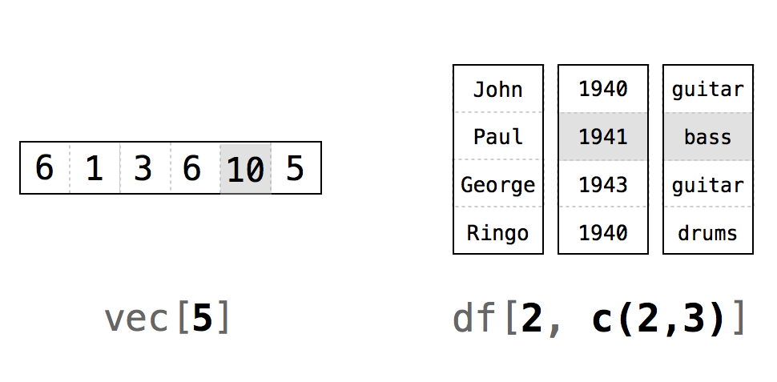
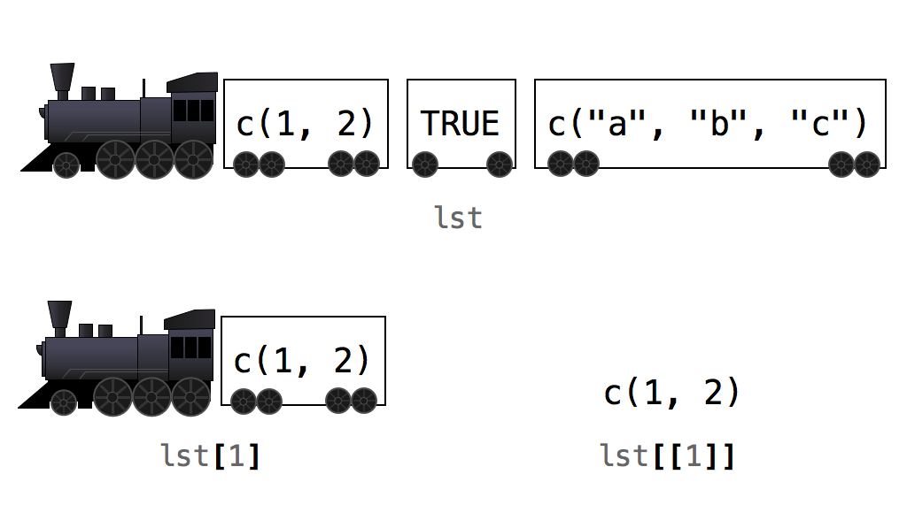

# R Notation

Now that you have a deck of cards, you need a way to do card-like things with it. First, you'll want to reshuffle the deck from time to time. And next, you'll want to deal cards from the deck (one card at a time, whatever card is on top—we're not cheaters).

To do these things, you'll need to work with the individual values inside your data frame, a task essential to data science. For example, to deal a card from the top of your deck, you'll need to write a function that selects the first row of values in your data frame, like this

```r
deal(deck)
##  face   suit value
##  king spades    13
```

You can select values within an R object with R's notation system.

## Selecting Values

R has a notation system that lets you extract values from R objects. To extract a value or set of values from a data frame, write the data frame's name followed by a pair of hard brackets:

```r
deck[ , ]
```

Between the brackets will go two indexes separated by a comma. The indexes tell R which values to return. R will use the first index to subset the rows of the data frame and the second index to subset the columns. 

You have a choice when it comes to writing indexes. There are six different ways to write an index for R, and each does something slightly different. They are all very simple and quite handy, so let's take a look at each of them. You can create indexes with:

* Positive integers
* Negative integers
* Zero
* Blank spaces
* Logical values
* Names

The simplest of these to use is positive integers.

### Positive Integers

R treats positive integers just like _ij_ notation in linear algebra: `deck[i,j]` will return the value of `deck` that is in the _ith_ row and the _jth_ column, Figure \@ref(fig:positive). Notice that _i_ and _j_ only need to be integers in the mathematical sense. They can be saved as numerics in R

```r
head(deck)
##  face   suit value
##  king spades    13
## queen spades    12
##  jack spades    11
##   ten spades    10
##  nine spades     9
## eight spades     8

deck[1, 1]
## "king"
```

To extract more than one value, use a vector of positive integers. For example, you can return the first row of `deck` with `deck[1, c(1, 2, 3)]` or `deck[1, 1:3]`:

```r
deck[1, c(1, 2, 3)]
## face   suit value
## king spades    13
```

R will return the values of `deck` that are in both the first row and the first, second, and third columns. Note that R won't actually remove these values from `deck`. R will give you a new set of values which are copies of the original values. You can then save this new set to an R object with R's assignment operator:

```r
new <- deck[1, c(1, 2, 3)]
new
## face   suit value
## king spades    13
```

```{block2, type = "rmdtip"}
**Repetition**
  
If you repeat a number in your index, R will return the corresponding value(s) more than once in your "subset." This code will return the first row of `deck` twice:
  
    deck[c(1, 1), c(1, 2, 3)]
    ## face   suit value
    ## king spades    13
    ## king spades    13

```

```{r positive, echo = FALSE, fig.cap = "R uses the _ij_ notation system of linear algebra. The commands in this figure will return the shaded values."}

```

R's notation system is not limited to data frames. You can use the same syntax to select values in any R object, as long as you supply one index for each dimension of the object. So, for example, you can subset a vector (which has one dimension) with a single index:

```r
vec <- c(6, 1, 3, 6, 10, 5)
vec[1:3]
## 6 1 3
```

```{block2, type = "rmdtip"}
**Indexing begins at 1**
  
In some programming languages, indexing begins with 0. This means that 0 returns the first element of a vector, 1 returns the second element, and so on. 

This isn't the case with R. Indexing in R behaves just like indexing in linear algebra. The first element is always indexed by 1. Why is R different? Maybe because it was written for mathematicians. Those of us who learned indexing from a linear algebra course wonder why computers programmers start with 0. 
```

```{block2, type = "rmdtip"}
**drop = FALSE**
  
If you select two or more columns from a data frame, R will return a new data frame:

    deck[1:2, 1:2]
    ##  face   suit
    ##  king spades
    ## queen spades

However, if you select a single column, R will return a vector:

    deck[1:2, 1]
    ##  "king"  "queen"

If you would prefer a data frame instead, you can add the optional argument `drop = FALSE` between the brackets: 

    deck[1:2, 1, drop = FALSE]
    ##  face
    ##  king
    ## queen

This method also works for selecting a single column from a matrix or an array.
```

### Negative Integers

Negative integers do the exact opposite of positive integers when indexing. R will return every element _except_ the elements in a negative index. For example, `deck[-1, 1:3]` will return everything _but_ the first row of `deck`. `deck[-(2:52), 1:3]` will return the first row (and exclude everything else):

```r
deck[-(2:52), 1:3]
## face   suit value
## king spades    13
```

Negative integers are a more efficient way to subset than positive integers if you want to include the majority of a data frame's rows or columns.

R will return an error if you try to pair a negative integer with a positive integer in the _same_ index: 

```r
deck[c(-1, 1), 1]
## Error in xj[i] : only 0's may be mixed with negative subscripts
```

However, you can use both negative and positive integers to subset an object if you use them in _different_ indexes (e.g., if you use one in the rows index and one in the columns index, like `deck[-1, 1]`).

### Zero

What would happen if you used zero as an index? Zero is neither a positive integer nor a negative integer, but R will still use it to do a type of subsetting. R will return nothing from a dimension when you use zero as an index. This creates an empty object:

```r
deck[0, 0]
## data frame with 0 columns and 0 rows
```

To be honest, indexing with zero is not very helpful.

### Blank Spaces

You can use a blank space to tell R to extract _every_ value in a dimension. This lets you subset an object on one dimension but not the others, which is useful for extracting entire rows or columns from a data frame:

```r
deck[1, ]
## face   suit value
## king spades    13
```

### Logical Values {#logic}

If you supply a vector of `TRUE`s and `FALSE`s as your index, R will match each `TRUE` and `FALSE` to a row in your data frame (or a column depending on where you place the index). R will then return each row that corresponds to a `TRUE`, Figure \@ref(fig:logicals). 

It may help to imagine R reading through the data frame and asking, "Should I return the _i_th row of the data structure?" and then consulting the _i_th value of the index for its answer. For this system to work, your vector must be as long as the dimension you are trying to subset: 

```r
deck[1, c(TRUE, TRUE, FALSE)]
## face   suit 
## king spades

rows <- c(TRUE, F, F, F, F, F, F, F, F, F, F, F, F, F, F, F, 
  F, F, F, F, F, F, F, F, F, F, F, F, F, F, F, F, F, F, F, F, F, F, 
  F, F, F, F, F, F, F, F, F, F, F, F, F, F)
deck[rows, ]
## face   suit value
## king spades    13
```

```{r logicals, echo = FALSE, fig.cap = "You can use vectors of TRUEs and FALSEs to tell R exactly which values you want to extract and which you do not. The command would return just the numbers 1, 6, and 5."}
knitr::include_graphics("images/hopr_0402.png")
``` 

This system may seem odd—who wants to type so many `TRUE`s and `FALSE`s?—but it will become very powerful in [Modifying Values].

### Names

Finally, you can ask for the elements you want by name—if your object has names (see [Names](#names)). This is a common way to extract the columns of a data frame, since columns almost always have names:

```r
deck[1, c("face", "suit", "value")]
## face   suit value
## king spades    13

# the entire value column
deck[ , "value"]
##  13 12 11 10  9  8  7  6  5  4  3  2  1 13 12 11 10  9  8
##  7  6  5  4  3  2  1 13 12 11 10  9  8  7  6  5  4  3  2
##  1 13 12 11 10  9  8  7  6  5  4  3  2  1
```

## Deal a Card

Now that you know the basics of R's notation system, let's put it to use. 

```{exercise, name = "Deal a Card"}
Complete the following code to make a function that returns the first row of a data frame:
```

```r
deal <- function(cards) {
   # ?
}
```

```{solution}
You can use any of the systems that return the first row of your data frame to write a `deal` function. I'll use positive integers and blanks because I think they are easy to understand:
```

```r
deal <- function(cards) {
  cards[1, ]
}
```

The function does exactly what you want: it deals the top card from your data set. However, the function becomes less impressive if you run `deal` over and over again:

```r
deal(deck)
## face   suit value
## king spades    13

deal(deck)
## face   suit value
## king spades    13

deal(deck)
## face   suit value
## king spades    13
```

`deal` always returns the king of spades because `deck` doesn't know that we've dealt the card away. Hence, the king of spades stays where it is, at the top of the deck ready to be dealt again. This is a difficult problem to solve, and we will _deal_ with it in [Environments]. In the meantime, you can fix the problem by shuffling your deck after every deal. Then a new card will always be at the top. 

Shuffling is a temporary compromise: the probabilities at play in your deck will not match the probabilities that occur when you play a game with a single deck of cards. For example, there will still be a probability that the king of spades appears twice in a row. However, things are not as bad as they may seem. Most casinos use five or six decks at a time in card games to prevent card counting. The probabilities that you would encounter in those situations are very close to the ones we will create here.

## Shuffle the Deck

When you shuffle a real deck of cards, you randomly rearrange the order of the cards. In your virtual deck, each card is a row in a data frame. To shuffle the deck, you need to randomly reorder the rows in the data frame. Can this be done? You bet! And you already know everything you need to do it. 

This may sound silly, but start by extracting every row in your data frame:

```r
deck2 <- deck[1:52, ]

head(deck2)
##   face   suit value
##   king spades    13
##  queen spades    12
##   jack spades    11
##    ten spades    10
##   nine spades     9
##  eight spades     8
```

What do you get? A new data frame whose order hasn't changed at all. What if you asked R to extract the rows in a different order? For example, you could ask for row 2, _then_ row 1, and then the rest of the cards:

```r
deck3 <- deck[c(2, 1, 3:52), ]

head(deck3)
##   face   suit value
##  queen spades    12
##   king spades    13
##   jack spades    11
##    ten spades    10
##   nine spades     9
##  eight spades     8
```

R complies. You'll get all the rows back, and they'll come in the order you ask for them. If you want the rows to come in a random order, then you need to sort the integers from 1 to 52 into a random order and use the results as a row index. How could you generate such a random collection of integers? With our friendly neighborhood `sample` function:

```r
random <- sample(1:52, size = 52)
random
##  35 28 39  9 18 29 26 45 47 48 23 22 21 16 32 38  1 15 20
##  11  2  4 14 49 34 25  8  6 10 41 46 17 33  5  7 44  3 27
##  50 12 51 40 52 24 19 13 42 37 43 36 31 30

deck4 <- deck[random, ]
head(deck4)
##   face     suit value
##   five diamonds     5
##  queen diamonds    12
##    ace diamonds     1
##   five   spades     5
##   nine    clubs     9
##   jack diamonds    11
```

Now the new set is truly shuffled. You'll be finished once you wrap these steps into a function. 

```{exercise, name = "Shuffle a Deck"}
Use the preceding ideas to write a `shuffle` function. `shuffle` should take a data frame and return a shuffled copy of the data frame.
```


```{solution}
Your `shuffle` function will look like the one that follows:
```

```r
shuffle <- function(cards) { 
  random <- sample(1:52, size = 52)
  cards[random, ]
}
```

Nice work! Now you can shuffle your cards between each deal:

```r
deal(deck)
## face   suit value
## king spades    13

deck2 <- shuffle(deck) 

deal(deck2)
## face  suit value
## jack clubs    11
```


## Dollar Signs and Double Brackets

Two types of object in R obey an optional second system of notation. You can extract values from data frames and lists with the `$` syntax. You will encounter the `$` syntax again and again as an R programmer, so let's examine how it works.

To select a column from a data frame, write the data frame's name and the column name separated by a `$`. Notice that no quotes should go around the column name:

```r
deck$value
## 13 12 11 10  9  8  7  6  5  4  3  2  1 13 12 11 10  9  8  7
##  6  5  4  3  2  1 13 12 11 10  9  8  7  6  5  4  3  2  1 13
## 12 11 10  9  8  7  6  5  4  3  2  1
```

R will return all of the values in the column as a vector. This `$` notation is incredibly useful because you will often store the variables of your data sets as columns in a data frame. From time to time, you'll want to run a function like `mean` or `median` on the values in a variable. In R, these functions expect a vector of values as input, and `deck$value` delivers your data in just the right format:

```r
mean(deck$value)
## 7

median(deck$value)
## 7
```

You can use the same `$` notation with the elements of a list, if they have names. This notation has an advantage with lists, too. If you subset a list in the usual way, R will return a _new_ list that has the elements you requested. This is true even if you only request a single element. 

To see this, make a list:

```r
lst <- list(numbers = c(1, 2), logical = TRUE, strings = c("a", "b", "c"))
lst
## $numbers
## [1] 1 2

## $logical
## [1] TRUE

## $strings
## [1] "a" "b" "c"
```

And then subset it:

```r
lst[1]
## $numbers
## [1] 1 2
```

The result is a smaller _list_ with one element. That element is the vector `c(1, 2)`. This can be annoying because many R functions do not work with lists. For example, `sum(lst[1])` will return an error. It would be horrible if once you stored a vector in a list, you could only ever get it back as a list:   

```r
sum(lst[1])
## Error in sum(lst[1]) : invalid 'type' (list) of argument
```


When you use the `$` notation, R will return the selected values as they are, with no list structure around them:

```r
lst$numbers
## 1 2
```

You can then immediately feed the results to a function:

```r
sum(lst$numbers)
## 3
```

If the elements in your list do not have names (or you do not wish to use the names), you can use two brackets, instead of one, to subset the list. This notation will do the same thing as the `$` notation:

```r
lst[[1]]
## 1 2
```

In other words, if you subset a list with single-bracket notation, R will return a smaller list. If you subset a list with double-bracket notation, R will return just the values that were inside an element of the list. You can combine this feature with any of R's indexing methods:

```r
lst["numbers"]
## $numbers
## [1] 1 2

lst[["numbers"]]
## 1 2
```

This difference is subtle but important. In the R community, there is a popular, and helpful, way to think about it, Figure \@ref(fig:trains). Imagine that each list is a train and each element is a train car. When you use single brackets, R selects individual train cars and returns them as a new train. Each car keeps its contents, but those contents are still inside a train car (i.e., a list). When you use double brackets, R actually unloads the car and gives you back the contents.

```{r trains, echo = FALSE, fig.cap = "It can be helpful to think of your list as a train. Use single brackets to select train cars, double brackets to select the contents inside of a car."}

```

```{block2, type = "rmdimportant"}
**Never attach**

In R's early days, it became popular to use `attach()` on a data set once you had it loaded. Don't do this! `attach` recreates a computing environment similar to those used in other statistics applications like Stata and SPSS, which crossover users liked. However, R is not Stata or SPSS. R is optimized to use the R computing environment, and running `attach()` can cause confusion with some R functions. 

What does `attach()` do? On the surface, `attach` saves you typing. If you attach the `deck` data set, you can refer to each of its variables by name; instead of typing `deck$face`, you can just type `face`.  But typing isn't bad. It gives you a chance to be explicit, and in computer programming, explicit is good. Attaching a data set creates the possibility that R will confuse two variable names. If this occurs within a function, you're likely to get unusable results and an unhelpful error message to explain what happened.
```

Now that you are an expert at retrieving values stored in R, let's summarize what you've accomplished.


## Summary

You have learned how to access values that have been stored in R. You can retrieve a copy of values that live inside a data frame and use the copies for new computations. 

In fact, you can use R's notation system to access values in any R object. To use it, write the name of an object followed by brackets and indexes. If your object is one-dimensional, like a vector, you only need to supply one index. If it is two-dimensional, like a data frame, you need to supply two indexes separated by a comma. And, if it is _n_-dimensional, you need to supply _n_ indexes, each separated by a comma. 

In [Modifying Values], you'll take this system a step further and learn how to change the actual values that are stored inside your data frame. This is all adding up to something special: complete control of your data. You can now store your data in your computer, retrieve individual values at will, and use your computer to perform correct calculations with those values. 

Does this sound basic? It may be, but it is also powerful and essential for efficient data science. You no longer need to memorize everything in your head, nor worry about doing mental arithmetic wrong. This low-level control over your data is also a prerequisite for more efficient R programs, the subject of [Project 3: Slot Machine].


