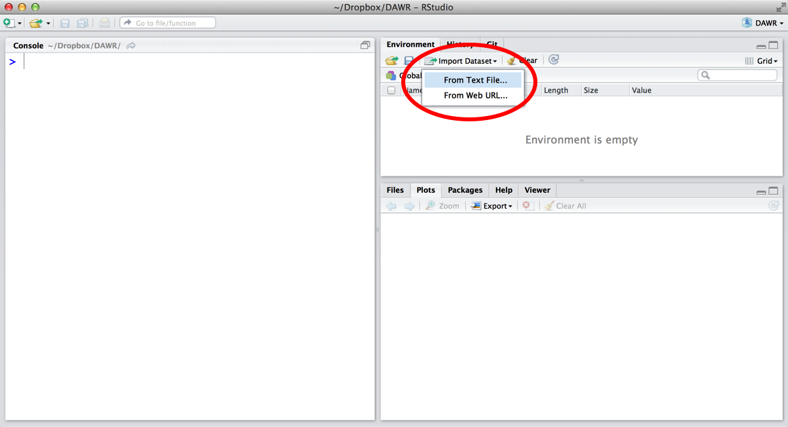
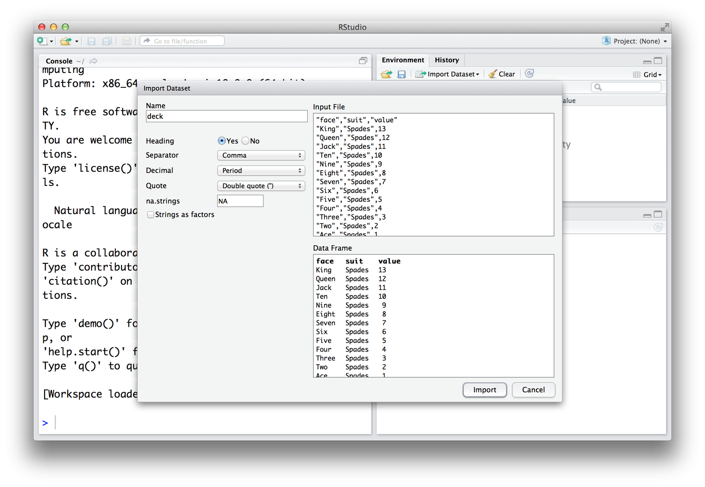
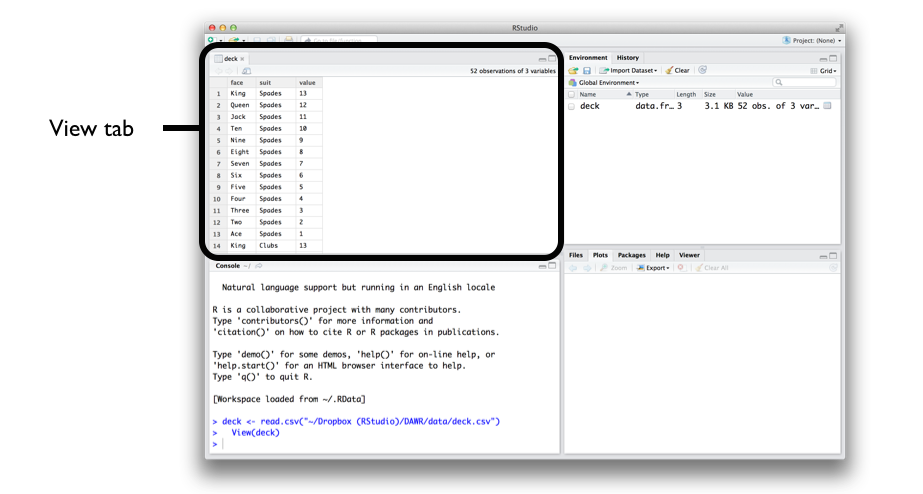
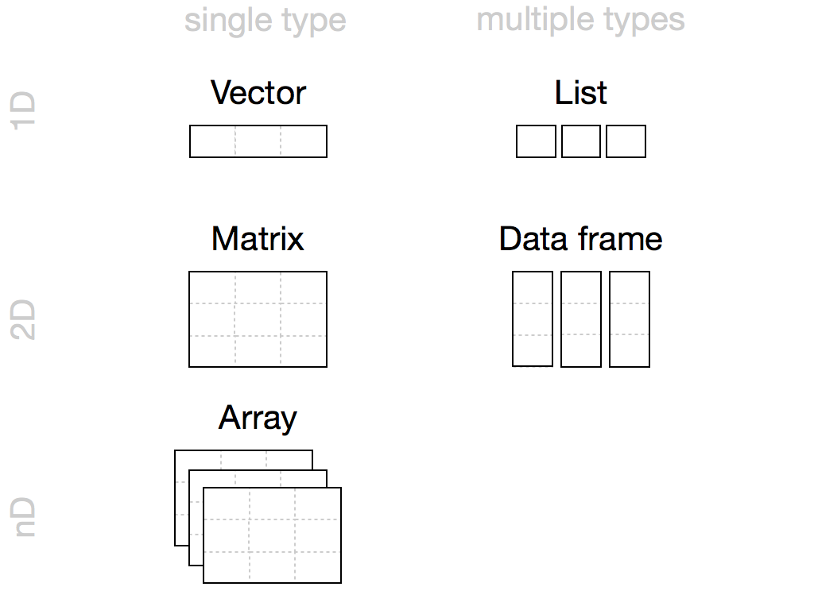

# R Objects

In this chapter, you'll use R to assemble a deck of 52 playing cards. 

You'll start by building simple R objects that represent playing cards and then work your way up to a full-blown table of data. In short, you'll build the equivalent of an Excel spreadsheet from scratch. When you are finished, your deck of cards will look something like this:

```r
 face   suit value
 king spades    13
queen spades    12
 jack spades    11
  ten spades    10
 nine spades     9
eight spades     8
...
```

Do you need to build a data set from scratch to use it in R? Not at all. You can load most data sets into R with one simple step, see [Loading Data]. But this exercise will teach you how R stores data, and how you can assemble—or disassemble—your own data sets. You will also learn about the various types of objects available for you to use in R (not all R objects are the same!). Consider this exercise a rite of passage; by doing it, you will become an expert on storing data in R.

We'll start with the very basics. The most simple type of object in R is an _atomic vector_. Atomic vectors are not nuclear powered, but they are very simple and they do show up everywhere. If you look closely enough, you'll see that most structures in R are built from atomic vectors. 

## Atomic Vectors

An atomic vector is just a simple vector of data. In fact, you've already made an atomic vector, your `die` object from [Project 1: Weighted Dice]. You can make an atomic vector by grouping some values of data together with `c`:

```r
die <- c(1, 2, 3, 4, 5, 6)
die
## 1 2 3 4 5 6

is.vector(die)
##  TRUE
```

```{block2, type = "rmdnote"}
**is.vector**
  
`is.vector` tests whether an object is an atomic vector. It returns `TRUE` if the object is an atomic vector and `FALSE` otherwise.
```

You can also make an atomic vector with just one value. R saves single values as an atomic vector of length 1:

```r
five <- 5
five
## 5

is.vector(five)
##  TRUE

length(five)
## 1
length(die)
## 6
```

```{block2, type = "rmdnote"}
**length**
  
`length` returns the length of an atomic vector.
```

Each atomic vector stores its values as a one-dimensional vector, and each atomic vector can only store one type of data. You can save different types of data in R by using different types of atomic vectors. Altogether, R recognizes six basic types of atomic vectors: _doubles_, _integers_, _characters_, _logicals_, _complex_, and _raw_.

To create your card deck, you will need to use different types of atomic vectors to save different types of information (text and numbers). You can do this by using some simple conventions when you enter your data. For example, you can create an integer vector by including a capital `L` with your input. You can create a character vector by surrounding your input in quotation marks:

```r
int <- 1L
text <- "ace"
```

Each type of atomic vector has its own convention (described below). R will recognize the convention and use it to create an atomic vector of the appropriate type. If you'd like to make atomic vectors that have more than one element in them, you can combine an element with the `c` function from [Packages and Help Pages]. Use the same convention with each element:

```r
int <- c(1L, 5L)
text <- c("ace", "hearts")
```

You may wonder why R uses multiple types of vectors. Vector types help R behave as you would expect. For example, R will do math with atomic vectors that contain numbers, but not with atomic vectors that contain character strings:

```r
sum(num)
## 6

sum(text)
## Error in sum(text) : invalid 'type' (character) of argument
```

But we're getting ahead of ourselves! Get ready to say hello to the six types of atomic vectors in R.

### Doubles

A double vector stores regular numbers. The numbers can be positive or negative, large or small, and have digits to the right of the decimal place or not. In general, R will save any number that you type in R as a double. So, for example, the die you made in [Project 1: Weighted Dice] was a double object:

```r
die <- c(1, 2, 3, 4, 5, 6)
die
## 1 2 3 4 5 6
```

You'll usually know what type of object you are working with in R (it will be obvious), but you can also ask R what type of object an object is with `typeof`. For example:

```r
typeof(die)
##  "double"
```

Some R functions refer to doubles as "numerics," and I will often do the same. Double is a computer science term. It refers to the specific number of bytes your computer uses to store a number, but I find "numeric" to be much more intuitive when doing data science.

### Integers

Integer vectors store integers, numbers that can be written without a decimal component. As a data scientist, you won't use the integer type very often because you can save integers as a double object.

You can specifically create an integer in R by typing a number followed by an uppercase  `L`. For example:

```r
int <- c(-1L, 2L, 4L)
int
## -1  2  4

typeof(int)
## "integer"
```

Note that R won't save a number as an integer unless you include the `L`. Integer numbers without the `L` will be saved as doubles. The only difference between `4` and `4L` is how R saves the number in your computer's memory. Integers are defined more precisely in your computer's memory than doubles (unless the integer is _very_ large or small). 

Why would you save your data as an integer instead of a double? Sometimes a difference in precision can have surprising effects. Your computer allocates 64 bits of memory to store each double in an R program. This allows a lot of precision, but some numbers cannot be expressed exactly in 64 bits, the equivalent of a sequence of 64 ones and zeroes. For example, the number latexmath:$\pi$ contains an endless sequences of digits to the right of the decimal place. Your computer must round $\pi$ to something close to, but not exactly equal to $\pi$ to store $\pi$ in its memory. Many decimal numbers share a similar fate. 

As a result, each double is accurate to about 16 significant digits. This introduces a little bit of error. In most cases, this rounding error will go unnoticed. However, in some situations, the rounding error can cause surprising results. For example, you may expect the result of the expression below to be zero, but it is not:

```r
sqrt(2)^2 - 2
## 4.440892e-16
```

The square root of two cannot be expressed exactly in 16 significant digits. As a result, R has to round the quantity, and the expression resolves to something very close to—but not quite—zero.

These errors are known as _floating-point_ errors, and doing arithmetic in these conditions is known as _floating-point arithmetic_. Floating-point arithmetic is not a feature of R; it is a feature of computer programming. Usually floating-point errors won't be enough to ruin your day. Just keep in mind that they may be the cause of surprising results. 

You can avoid floating-point errors by avoiding decimals and only using integers. However, this is not an option in most data-science situations. You cannot do much math with integers before you need a noninteger to express the result. Luckily, the errors caused by floating-point arithmetic are usually insignificant (and when they are not, they are easy to spot). As a result, you'll generally use doubles instead of integers as a data scientist.

### Characters

A character vector stores small pieces of text. You can create a character vector in R by typing a character or string of characters surrounded by quotes: 

```r
text <- c("Hello",  "World")
text
##  "Hello"  "World"

typeof(text)
## "character"

typeof("Hello")
## "character"
```

The individual elements of a character vector are known as _strings_. Note that a string can contain more than just letters. You can assemble a character string from numbers or symbols as well.

```{exercise, name = "Character or Number?"}
Can you spot the difference between a character string and a number? Here's a test: Which of these are character strings and which are numbers? `1`, `"1"`, `"one"`.
```
  

```{solution}
`"1"` and `"one"` are both character strings. 
```

Character strings can contain number characters, but that doesn't make them numeric. They're just strings that happen to have numbers in them. You can tell strings from real numbers because strings come surrounded by quotes. In fact, anything surrounded by quotes in R will be treated as a character string—no matter what appears between the quotes.

It is easy to confuse R objects with character strings. Why? Because both appear as pieces of text in R code. For example, `x` is the name of an R object named "x," `"x"` is a character string that contains the character "x." One is an object that contains raw data, the other is a piece of raw data itself. 

Expect an error whenever you forget your quotation marks; R will start looking for an object that probably does not exist. 

### Logicals

Logical vectors store `TRUE`s and `FALSE`s, R's form of Boolean data. Logicals are very helpful for doing things like comparisons:

```r
3 > 4
## FALSE
```

Any time you type `TRUE` or `FALSE` in capital letters (without quotation marks), R will treat your input as logical data. R also assumes that `T` and `F` are shorthand for `TRUE` and `FALSE`:

```r
logic <- c(TRUE, FALSE, TRUE)
logic
##   TRUE FALSE  TRUE

typeof(logic)
## "logical"

typeof(F)
## "logical"
```

### Complex and Raw

Doubles, integers, characters, and logicals are the most common types of atomic vectors in R, but R also recognizes two more types: complex and raw. It is doubtful that you will ever use these to analyze data, but here they are for the sake of thoroughness.

Complex vectors store complex numbers. To create a complex vector, add an imaginary term to a number with `i`:

```r
comp <- c(1 + 1i, 1 + 2i, 1 + 3i)
comp
## 1+1i 1+2i 1+3i

typeof(comp)
## "complex"
```

Raw vectors store raw bytes of data. Making raw vectors gets complicated, but you can make an empty raw vector of length _n_ with `raw(n)`. See the help page of `raw` for more options when working with this type of data:

```r
raw(3)
## 00 00 00

typeof(raw(3))
## "raw"
```

```{exercise, name = "Vector of Cards"}
Create an atomic vector that stores just the face names of the cards in a royal flush, for example, the ace of spades, king of spades, queen of spades, jack of spades, and ten of spades. The face name of the ace of spades would be "ace," and "spades" is the suit.

Which type of vector will you use to save the names? 
```

```{solution}
A character vector is the most appropriate type of atomic vector in which to save card names. You can create one with the `c` function if you surround each name with quotation marks:
```

```r
hand <- c("ace", "king", "queen", "jack", "ten")
hand
## "ace"   "king"  "queen" "jack"  "ten"  

typeof(hand)
## "character"
```

This creates a one-dimensional group of card names—great job! Now let's make a more sophisticated data structure, a two-dimensional table of card names and suits. You can build a more sophisticated object from an atomic vector by giving it some attributes and assigning it a class. 

## Attributes {#attributes}

An attribute is a piece of information that you can attach to an atomic vector (or any R object). The attribute won't affect any of the values in the object, and it will not appear when you display your object. You can think of an attribute as "metadata"; it is just a convenient place to put information associated with an object. R will normally ignore this metadata, but some R functions will check for specific attributes. These functions may use the attributes to do special things with the data.

You can see which attributes an object has with `attributes`. `attributes` will return `NULL` if an object has no attributes. An atomic vector, like `die`, won't have any attributes unless you give it some: 

```r
attributes(die)
## NULL
```

```{block2, type = "rmdtip"}
**NULL**
  
R uses `NULL` to represent the null set, an empty object. `NULL` is often returned by functions whose values are undefined. You can create a `NULL` object by typing `NULL` in capital letters.
```

### Names {#names}

The most common attributes to give an atomic vector are names, dimensions (dim), and classes. Each of these attributes has its own helper function that you can use to give attributes to an object. You can also use the helper functions to look up the value of these attributes for objects that already have them. For example, you can look up the value of the names attribute of `die` with `names`:

```r
names(die)
## NULL
```

`NULL` means that `die` does not have a names attribute. You can give one to `die` by assigning a character vector to the output of `names`. The vector should include one name for each element in `die`: 

```r
names(die) <- c("one", "two", "three", "four", "five", "six")
```

Now `die` has a names attribute:

```r
names(die)
## "one"   "two"   "three" "four"  "five"  "six" 

attributes(die)
## $names
## [1] "one"   "two"   "three" "four"  "five"  "six"
```

R will display the names above the elements of `die` whenever you look at the vector:

```r
die
##  one   two three  four  five   six 
##    1     2     3     4     5     6 
```

However, the names won't affect the actual values of the vector, nor will the names be affected when you manipulate the values of the vector:

```r
die + 1
##  one   two three  four  five   six 
##    2     3     4     5     6     7
```

You can also use `names` to change the names attribute or remove it all together. To change the names, assign a new set of labels to `names`: 

```r
names(die) <- c("uno", "dos", "tres", "quatro", "cinco", "seis")
die
##   uno    dos   tres quatro  cinco   seis 
##     1      2      3      4      5      6 
```

To remove the names attribute, set it to `NULL`:

```r
names(die) <- NULL
die
##  1 2 3 4 5 6
```

### Dim

You can transform an atomic vector into an _n_-dimensional array by giving it a dimensions attribute with `dim`. To do this, set the `dim` attribute to a numeric vector of length _n_. R will reorganize the elements of the vector into _n_ dimensions. Each dimension will have as many rows (or columns, etc.) as the _nth_ value of the `dim` vector. For example, you can reorganize `die` into a 2 &#x00D7; 3 matrix (which has 2 rows and 3 columns):

```r
dim(die) <- c(2, 3)
die
##      [,1] [,2] [,3]
## [1,]    1    3    5
## [2,]    2    4    6
```

or a 3 &#x00D7; 2 matrix (which has 3 rows and 2 columns):

```r
dim(die) <- c(3, 2)
die
##      [,1] [,2]
## [1,]    1    4
## [2,]    2    5
## [3,]    3    6
```

or a 1 &#x00D7; 2 &#x00D7; 3 hypercube (which has 1 row, 2 columns, and 3 "slices"). This is a three-dimensional structure, but R will need to show it slice by slice by slice on your two-dimensional computer screen:

```r
dim(die) <- c(1, 2, 3)
die
## , , 1
## 
##      [,1] [,2]
## [1,]    1    2
## 
## , , 2
## 
##      [,1] [,2]
## [1,]    3    4
## 
## , , 3
## 
##      [,1] [,2]
## [1,]    5    6

```

R will always use the first value in `dim` for the number of rows and the second value for the number of columns. In general, rows always come first in R operations that deal with both rows and columns. 

You may notice that you don't have much control over how R reorganizes the values into rows and columns. For example, R always fills up each matrix by columns, instead of by rows. If you'd like more control over this process, you can use one of R's helper functions, `matrix` or `array`. They do the same thing as changing the `dim` attribute, but they provide extra arguments to customize the process.

## Matrices

Matrices store values in a two-dimensional array, just like a matrix from linear algebra. To create one, first give `matrix` an atomic vector to reorganize into a matrix. Then, define how many rows should be in the matrix by setting the `nrow` argument to a number. `matrix` will organize your vector of values into a matrix with the specified number of rows. Alternatively, you can set the `ncol` argument, which tells R how many columns to include in the matrix: 

```r
m <- matrix(die, nrow = 2)
m
##      [,1] [,2] [,3]
## [1,]    1    3    5
## [2,]    2    4    6
```

`matrix` will fill up the matrix column by column by default, but you can fill the matrix row by row if you include the argument `byrow = TRUE`:

```r
m <- matrix(die, nrow = 2, byrow = TRUE)
m
##      [,1] [,2] [,3]
## [1,]    1    2    3
## [2,]    4    5    6
```

`matrix` also has other default arguments that you can use to customize your matrix. You can read about them at `matrix`'s help page (accessible by `?matrix`).

## Arrays

The `array` function creates an n-dimensional array. For example, you could use `array` to sort values into a cube of three dimensions or a hypercube in 4, 5, or _n_ dimensions. `array` is not as customizeable as `matrix` and basically does the same thing as setting the `dim` attribute. To use `array`, provide an atomic vector as the first argument, and a vector of dimensions as the second argument, now called `dim`:

```r
ar <- array(c(11:14, 21:24, 31:34), dim = c(2, 2, 3))
ar
## , , 1
## 
##      [,1] [,2]
## [1,]   11   13
## [2,]   12   14
## 
## , , 2
## 
##      [,1] [,2]
## [1,]   21   23
## [2,]   22   24
## 
## , , 3
## 
##      [,1] [,2]
## [1,]   31   33
## [2,]   32   34
```

```{exercise, name = "Make a Matrix"}
Create the following matrix, which stores the name and suit of every card in a royal flush.
```

```r
##      [,1]    [,2]    
## [1,] "ace"   "spades"
## [2,] "king"  "spades"
## [3,] "queen" "spades"
## [4,] "jack"  "spades"
## [5,] "ten"   "spades"
```

```{solution}
There is more than one way to build this matrix, but in every case, you will need to start by making a character vector with 10 values. If you start with the following character vector, you can turn it into a matrix with any of the following three commands:
```

```r
hand1 <- c("ace", "king", "queen", "jack", "ten", "spades", "spades", 
  "spades", "spades", "spades")

matrix(hand1, nrow = 5)
matrix(hand1, ncol = 2)
dim(hand1) <- c(5, 2)
```
You can also start with a character vector that lists the cards in a slightly different order. In this case, you will need to ask R to fill the matrix row by row instead of column by column:

```r
hand2 <- c("ace", "spades", "king", "spades", "queen", "spades", "jack", 
  "spades", "ten", "spades")

matrix(hand2, nrow = 5, byrow = TRUE)
matrix(hand2, ncol = 2, byrow = TRUE)
```

## Class

Notice that changing the dimensions of your object will not change the type of the object, but it _will_ change the object's `class` attribute:

```r
dim(die) <- c(2, 3)
typeof(die)
##  "double"
 
class(die)
##  "matrix"
```

A matrix is a special case of an atomic vector. For example, the `die` matrix is a special case of a double vector. Every element in the matrix is still a double, but the elements have been arranged into a new structure. R added a `class` attribute to `die` when you changed its dimensions. This class describes `die`'s new format. Many R functions will specifically look for an object's `class` attribute, and then handle the object in a predetermined way based on the attribute.

Note that an object's `class` attribute will not always appear when you run `attributes`; you may need to specifically search for it with `class`:

```r
attributes(die)
## $dim
## [1] 2 3
```

You can apply `class` to objects that do not have a `class` attribute. `class` will return a value based on the object's atomic type. Notice that the "class" of a double is "numeric," an odd deviation, but one I am thankful for. I think that the most important property of a double vector is that it contains numbers, a property that "numeric" makes obvious:

```r
class("Hello")
##  "character"

class(5)
##  "numeric"
```

You can also use `class` to set an object's `class` attribute, but this is usually a bad idea. R will expect objects of a class to share certain traits, such as attributes, that your object may not possess. You'll learn how to make and use your own classes in [Project 3: Slot Machine].

### Dates and Times

The attribute system lets R represent more types of data than just doubles, integers, characters, logicals, complexes, and raws. The time looks like a character string when you display it, but its data type is actually `"double"`, and its class is `"POSIXct"` `"POSIXt"` (it has two classes):

```r
now <- Sys.time()
now
## "2014-03-17 12:00:00 UTC"

typeof(now)
##  "double"

class(now)
## "POSIXct" "POSIXt" 
```

POSIXct is a widely used framework for representing dates and times. In the POSIXct framework, each time is represented by the number of seconds that have passed between the time and 12:00 AM January 1st 1970 (in the Universal Time Coordinated (UTC) zone). For example, the time above occurs 1,395,057,600 seconds after then. So in the POSIXct system, the time would be saved as 1395057600.

R creates the time object by building a double vector with one element, `1395057600`. You can see this vector by removing the `class` attribute of `now`, or by using the `unclass` function, which does the same thing:

```r
unclass(now)
## 1395057600
```

R then gives the double vector a `class` attribute that contains two classes, `"POSIXct"` and `"POSIXt"`. This attribute alerts R functions that they are dealing with a POSIXct time, so they can treat it in a special way. For example, R functions will use the POSIXct standard to convert the time into a user-friendly character string before displaying it. 

You can take advantage of this system by giving the `POSIXct` class to random R objects. For example, have you ever wondered what day it was a million seconds after 12:00 a.m. Jan. 1, 1970?

```r
mil <- 1000000
mil
## 1e+06
 
class(mil) <- c("POSIXct", "POSIXt")
mil
## "1970-01-12 13:46:40 UTC"
```

Jan. 12, 1970. Yikes. A million seconds goes by faster than you would think. This conversion worked well because the `POSIXct` class does not rely on any additional attributes, but in general, forcing the class of an object is a bad idea.

There are many different classes of data in R and its packages, and new classes are invented every day. It would be difficult to learn about every class, but you do not have to. Most classes are only useful in specific situations. Since each class comes with its own help page, you can wait to learn about a class until you encounter it. However, there is one class of data that is so ubiquitous in R that you should learn about it alongside the atomic data types. That class is `factors`.

### Factors

Factors are R's way of storing categorical information, like ethnicity or eye color. Think of a factor as something like a gender; it can only have certain values (male or female), and these values may have their own idiosyncratic order (ladies first). This arrangement makes factors very useful for recording the treatment levels of a study and other categorical variables. 

To make a factor, pass an atomic vector into the `factor` function. R will recode the data in the vector as integers and store the results in an integer vector. R will also add a `levels` attribute to the integer, which contains a set of labels for displaying the factor values, and a `class` attribute, which contains the class `factor`:

```r
gender <- factor(c("male", "female", "female", "male"))

typeof(gender)
## "integer"

attributes(gender)
## $levels
## [1] "female" "male"  
## 
## $class
## [1] "factor"
```

You can see exactly how R is storing your factor with `unclass`:

```r
unclass(gender)
## [1] 2 1 1 2
## attr(,"levels")
## [1] "female" "male"  
```

R uses the levels attribute when it displays the factor, as you will see. R will display each `1` as `female`, the first label in the levels vector, and each `2` as `male`, the second label. If the factor included `3`s, they would be displayed as the third label, and so on:

```r
gender
## male   female female male  
## Levels: female male
```

Factors make it easy to put categorical variables into a statistical model because the variables are already coded as numbers. However, factors can be confusing since they look like character strings but behave like integers. 

R will often try to convert character strings to factors when you load and create data. In general, you will have a smoother experience if you do not let R make factors until you ask for them. I'll show you how to do this when we start reading in data.

You can convert a factor to a character string with the `as.character` function. R will retain the display version of the factor, not the integers stored in memory:

```r
as.character(gender)
## "male"   "female" "female" "male"
```

Now that you understand the possibilities provided by R's atomic vectors, let's make a more complicated type of playing card.

```{exercise, name = "Write a Card"}
Many card games assign a numerical value to each card. For example, in blackjack, each face card is worth 10 points, each number card is worth between 2 and 10 points, and each ace is worth 1 or 11 points, depending on the final score.

Make a virtual playing card by combining "ace," "heart," and 1 into a vector. What type of atomic vector will result? Check if you are right.
```

```{solution}
You may have guessed that this exercise would not go well. Each atomic vector can only store one type of data. As a result, R coerces all of your values to character strings:
```

```r
card <- c("ace", "hearts", 1)
card
## "ace"    "hearts" "1" 
```

This will cause trouble if you want to do math with that point value, for example, to see who won your game of blackjack. 

```{block2, type = "rmdwarning"}
**Data types in vectors**

If you try to put multiple types of data into a vector, R will convert the elements to a single type of data. 
```

Since matrices and arrays are special cases of atomic vectors, they suffer from the same behavior. Each can only store one type of data. 

This creates a couple of problems. First, many data sets contain multiple types of data. Simple programs like Excel and Numbers can save multiple types of data in the same data set, and you should hope that R can too. Don't worry, it can. 

Second, coercion is a common behavior in R, so you'll want to know how it works.

## Coercion

R's coercion behavior may seem inconvenient, but it is not arbitrary. R always follows the same rules when it coerces data types. Once you are familiar with these rules, you can use R's coercion behavior to do surprisingly useful things.

So how does R coerce data types? If a character string is present in an atomic vector, R will convert everything else in the vector to character strings. If a vector only contains logicals and numbers, R will convert the logicals to numbers; every `TRUE` becomes a 1, and every `FALSE` becomes a 0, as shown in \@ref(fig:coercion). 

```{r coercion, echo = FALSE, fig.cap = "R always uses the same rules to coerce data to a single type. If character strings are present, everything will be coerced to a character string. Otherwise, logicals are coerced to numerics."}
knitr::include_graphics("images/hopr_0301.png")
```

This arrangement preserves information. It is easy to look at a character string and tell what information it used to contain. For example, you can easily spot the origins of `"TRUE"` and `"5"`. You can also easily back-transform a vector of 1s and 0s to `TRUE`s and `FALSE`s. 

R uses the same coercion rules when you try to do math with logical values. So the following code:

```r
sum(c(TRUE, TRUE, FALSE, FALSE))
```

will become:

```r
sum(c(1, 1, 0, 0))
## 2
```

This means that `sum` will count the number of `TRUE`s in a logical vector (and `mean` will calculate the proportion of `TRUE`s). Neat, huh? 

You can explicitly ask R to convert data from one type to another with the `as` functions. R will convert the data whenever there is a sensible way to do so:

```r
as.character(1)
## "1"

as.logical(1)
## TRUE

as.numeric(FALSE)
## 0
```

You now know how R coerces data types, but this won't help you save a playing card. To do that, you will need to avoid coercion altogether. You can do this by using a new type of object, a _list_.

Before we look at lists, let's address a question that might be on your mind.

Many data sets contain multiple types of information. The inability of vectors, matrices, and arrays to store multiple data types seems like a major limitation. So why bother with them? 

In some cases, using only a single type of data is a huge advantage. Vectors, matrices, and arrays make it very easy to do math on large sets of numbers because R knows that it can manipulate each value the same way. Operations with vectors, matrices, and arrays also tend to be fast because the objects are so simple to store in memory.

In other cases, allowing only a single type of data is not a disadvantage. Vectors are the most common data structure in R because they store variables very well. Each value in a variable measures the same property, so there's no need to use different types of data.

## Lists

Lists are like atomic vectors because they group data into a one-dimensional set. However, lists do not group together individual values; lists group together R objects, such as atomic vectors and other lists. For example, you can make a list that contains a numeric vector of length 31 in its first element, a character vector of length 1 in its second element, and a new list of length 2 in its third element. To do this, use the `list` function. 

`list` creates a list the same way `c` creates a vector. Separate each element in the list with a comma:

```r
list1 <- list(100:130, "R", list(TRUE, FALSE))
list1
## [[1]]
## [1] 100 101 102 103 104 105 106 107 108 109 110 111 112
## [14] 113 114 115 116 117 118 119 120 121 122 123 124 125
## [27] 126 127 128 129 130
## 
## [[2]]
## [1] "R"
##
## [[3]]
## [[3]][[1]]
## [1] TRUE
##
## [[3]][[2]]
## [1] FALSE
```

I left the `[1]` notation in the output so you can see how it changes for lists. The double-bracketed indexes tell you which element of the list is being displayed. The single-bracket indexes tell you which subelement of an element is being displayed. For example, `100` is the first subelement of the first element in the list. `"R"` is the first sub-element of the second element. This two-system notation arises because each element of a list can be _any_ R object, including a new vector (or list) with its own indexes.

Lists are a basic type of object in R, on par with atomic vectors. Like atomic vectors, they are used as building blocks to create many more spohisticated types of R objects.

As you can imagine, the structure of lists can become quite complicated, but this flexibility makes lists a useful all-purpose storage tool in R: you can group together anything with a list. 

However, not every list needs to be complicated. You can store a playing card in a very simple list. 

```{exercise, name = "Use a List to Make a Card"}
Use a list to store a single playing card, like the ace of hearts, which has a point value of one. The list should save the face of the card, the suit, and the point value in separate elements.
```

```{solution}
You can create your card like this. In the following example, the first element of the list is a character vector (of length 1). The second element is also a character vector, and the third element is a numeric vector:
```

```r
card <- list("ace", "hearts", 1)
card
## [[1]]
## [1] "ace"
##
## [[2]]
## [1] "hearts"
##
## [[3]]
## [1] 1
```

You can also use a list to store a whole deck of playing cards. Since you can save a single playing card as a list, you can save a deck of playing cards as a list of 52 sublists (one for each card). But let's not bother—there's a much cleaner way to do the same thing. You can use a special class of list, known as a _data frame_.

## Data Frames

Data frames are the two-dimensional version of a list. They are far and away the most useful storage structure for data analysis, and they provide an ideal way to store an entire deck of cards. You can think of a data frame as R's equivalent to the Excel spreadsheet because it stores data in a similar format. 

Data frames group vectors together into a two-dimensional table. Each vector becomes a column in the table. As a result, each column of a data frame can contain a different type of data; but within a column, every cell must be the same type of data, as in \@ref(fig:data-frame).

```{r data-frame, echo = FALSE, fig.cap = "Data frames store data as a sequence of columns. Each column can be a different data type. Every column in a data frame must be the same length."}
knitr::include_graphics("images/hopr_0302.png")
```

Creating a data frame by hand takes a lot of typing, but you can do it (if you like) with the `data.frame` function. Give `data.frame` any number of vectors, each separated with a comma. Each vector should be set equal to a name that describes the vector. `data.frame` will turn each vector into a column of the new data frame: 

```r
df <- data.frame(face = c("ace", "two", "six"),  
  suit = c("clubs", "clubs", "clubs"), value = c(1, 2, 3))
df
## face  suit value
##  ace clubs     1
##  two clubs     2
##  six clubs     3
```

You'll need to make sure that each vector is the same length (or can be made so with R's recycling rules; see \@ref(fig:recycle), as data frames cannot combine columns of different lengths.

In the previous code, I named the arguments in `data.frame` `face`, `suit`, and `value`, but you can name the arguments whatever you like. `data.frame` will use your argument names to label the columns of the data frame.

```{block2, type = "rmdtip"}
**Names**
  
You can also give names to a list or vector when you create one of these objects. Use the same syntax as with `data.frame`:
  
`list(face = "ace", suit = "hearts", value = 1)`  
`c(face = "ace", suit = "hearts", value = "one")`

The names will be stored in the object's `names` attribute.
```

If you look at the type of a data frame, you will see that it is a list. In fact, each data frame is a list with class `data.frame`. You can see what types of objects are grouped together by a list (or data frame) with the `str` function:

```r
typeof(df)
## "list"

class(df)
## "data.frame"

str(df)
## 'data.frame':	3 obs. of  3 variables:
##  $ face : Factor w/ 3 levels "ace","six","two": 1 3 2
##  $ suit : Factor w/ 1 level "clubs": 1 1 1
##  $ value: num  1 2 3
```

Notice that R saved your character strings as factors. I told you that R likes factors! It is not a very big deal here, but you can prevent this behavior by adding the argument `stringsAsFactors = FALSE` to `data.frame`:

```r
df <- data.frame(face = c("ace", "two", "six"),  
  suit = c("clubs", "clubs", "clubs"), value = c(1, 2, 3),
  stringsAsFactors = FALSE)
```

A data frame is a great way to build an entire deck of cards. You can make each row in the data frame a playing card, and each column a type of value—each with its own appropriate data type. The data frame would look something like this:

```r
##   face     suit value
##   king   spades    13
##  queen   spades    12
##   jack   spades    11
##    ten   spades    10
##   nine   spades     9
##  eight   spades     8
##  seven   spades     7
##    six   spades     6
##   five   spades     5
##   four   spades     4
##  three   spades     3
##    two   spades     2
##    ace   spades     1
##   king    clubs    13
##  queen    clubs    12
##   jack    clubs    11
##    ten    clubs    10
##   ... and so on.
```

You could create this data frame with `data.frame`, but look at the typing involved! You need to write three vectors, each with 52 elements:

```r
deck <- data.frame(
  face = c("king", "queen", "jack", "ten", "nine", "eight", "seven", "six",
    "five", "four", "three", "two", "ace", "king", "queen", "jack", "ten", 
    "nine", "eight", "seven", "six", "five", "four", "three", "two", "ace", 
    "king", "queen", "jack", "ten", "nine", "eight", "seven", "six", "five", 
    "four", "three", "two", "ace", "king", "queen", "jack", "ten", "nine", 
    "eight", "seven", "six", "five", "four", "three", "two", "ace"),  
  suit = c("spades", "spades", "spades", "spades", "spades", "spades", 
    "spades", "spades", "spades", "spades", "spades", "spades", "spades", 
    "clubs", "clubs", "clubs", "clubs", "clubs", "clubs", "clubs", "clubs", 
    "clubs", "clubs", "clubs", "clubs", "clubs", "diamonds", "diamonds", 
    "diamonds", "diamonds", "diamonds", "diamonds", "diamonds", "diamonds", 
    "diamonds", "diamonds", "diamonds", "diamonds", "diamonds", "hearts", 
    "hearts", "hearts", "hearts", "hearts", "hearts", "hearts", "hearts", 
    "hearts", "hearts", "hearts", "hearts", "hearts"), 
  value = c(13, 12, 11, 10, 9, 8, 7, 6, 5, 4, 3, 2, 1, 13, 12, 11, 10, 9, 8, 
    7, 6, 5, 4, 3, 2, 1, 13, 12, 11, 10, 9, 8, 7, 6, 5, 4, 3, 2, 1, 13, 12, 11, 
    10, 9, 8, 7, 6, 5, 4, 3, 2, 1)
)
```

You should avoid typing large data sets in by hand whenever possible. Typing invites typos and errors, not to mention RSI. It is always better to acquire large data sets as a computer file. You can then ask R to read the file and store the contents as an object. 

I've created a file for you to load that contains a data frame of playing-card information, so don't worry about typing in the code. Instead, turn your attention toward loading data into R.

## Loading Data {#loading}

You can load the `deck` data frame from the file [_deck.csv_](http://bit.ly/deck_CSV). Please take a moment to download the file before reading on. Visit the website, click "Download Gist," and then open the folder that your web browser downloads. _deck.csv_ will be inside.

_deck.csv_ is a comma-separated values file, or CSV for short. CSVs are plain-text files, which means you can open them in a text editor (as well as many other programs). If you open _desk.csv_, you'll notice that it contains a table of data that looks like the following table. Each row of the table is saved on its own line, and a comma is used to separate the cells within each row.  Every CSV file shares this basic format:

```
"face","suit,"value"
"king","spades",13
"queen","spades,12
"jack","spades,11
"ten","spades,10
"nine","spades,9
... and so on.
```

Most data-science applications can open plain-text files and export data as plain-text files. This makes plain-text files a sort of lingua franca for data science. 

To load a plain-text file into R, click the Import Dataset icon in RStudio, shown in \@ref(fig:import). Then select "From text file."

```{r import, echo = FALSE, fig.cap = "You can import data from plain-text files with RStudio's Import Dataset."}

```

RStudio will ask you to select the file you want to import, then it will open a wizard to help you import the data, as in \@ref(fig:wizard). Use the wizard to tell RStudio what name to give the data set.  You can also use the wizard to tell RStudio which character the data set uses as a separator, which character it uses to represent decimals (usually a period in the United States and a comma in Europe), and whether or not the data set comes with a row of column names (known as a _header_). To help you out, the wizard shows you what the raw file looks like, as well as what your loaded data will look like based on the input settings.

You can also unclick the box "Strings as factors" in the wizard. I recommend doing this. If you do, R will load all of your character strings as character strings. If you do not, R will convert them to factors.

```{r wizard, echo = FALSE, fig.cap = "RStudio's import wizard."}

```

Once everything looks right, click Import. RStudio will read in the data and save it to a data frame. RStudio will also open a data viewer, so you can see your new data in a spreadsheet format. This is a good way to check that everything came through as expected. If all worked well, your file should appear in a View tab of RStudio, like in \@ref(fig:view). You can examine the data frame in the console with *`head(deck)`*.

```{block2, type = "rmdtip"}
**Online data**
  
You can load a plain-text file straight from the Internet by clicking the "From Web URL..." option under Import Dataset. The file will need to have its own URL, and you will need to be connected.
```

```{r view, echo = FALSE, fig.cap = "When you import a data set, RStudio will save the data to a data frame and then display the data frame in a View tab. You can open any data frame in a View tab at any time with the View function."}

```

Now it is your turn. Download _deck.csv_ and import it into RStudio. Be sure to save the output to an R object called `deck`: you'll use it in the next few chapters. If everything goes correctly, the first few lines of your data frame should look like this:

```r
head(deck)
##  face   suit value
##  king spades    13
## queen spades    12
##  jack spades    11
##   ten spades    10
##  nine spades     9
## eight spades     8
```

```{block2, type = "rmdnote"}
`head` and `tail` are two functions that provide an easy way to peek at large data sets. `head` will return just the first six rows of the data set, and `tail` will return just the last six rows. To see a different number of rows, give `head` or `tails` a second argument, the number of rows you would like to view, for example, `head(deck, 10)`.
```

R can open many types of files—not just CSVs. Visit [Loading and Saving Data in R] to learn how to open other common types of files in R.

## Saving Data

Before we go any further, let's save a copy of `deck` as a new _.csv_ file. That way you can email it to a colleague, store it on a thumb drive, or open it in a different program. You can save any data frame in R to a _.csv_ file with the command `write.csv`. To save `deck`, run:

```r
write.csv(deck, file = "cards.csv", row.names = FALSE)
```

R will turn your data frame into a plain-text file with the comma-separated values format and save the file to your working directory. To see where your working directory is, run *`getwd()`*. To change the location of your working directory, visit Session > Set Working Directory > Choose Directory in the RStudio menu bar. 

You can customize the save process with `write.csv`'s large set of optional arguments (see `?write.csv` for details). However, there are three arguments that you should use _every_ time you run `write.csv`. 

First, you should give `write.csv` the name of the data frame that you wish to save. Next, you should provide a file name to give your file. R will take this name quite literally, so be sure to provide an extension. 

Finally, you should add the argument `row.names = FALSE`. This will prevent R from adding a column of numbers at the start of your data frame. These numbers will identify your rows from 1 to 52, but it is unlikely that whatever program you open _cards.csv_ in will understand the row name system. More than likely, the program will assume that the row names are the first column of data in your data frame. In fact, this is exactly what R will assume if you reopen _cards.csv_. If you save and open _cards.csv_ several times in R, you'll notice duplicate columns of row numbers forming at the start of your data frame. I can't explain why R does this, but I can explain how to avoid it: use `row.names = FALSE` whenever you save data with `write.csv`.

For more details about saving files, including how to compress saved files and how to save files in other formats, see [Loading and Saving Data in R].

Good work. You now have a virtual deck of cards to work with. Take a breather, and when you come back, we'll start writing some functions to use on your deck.

## Summary

You can save data in R with five different objects, which let you store different types of values in different types of relationships, as in \@ref(fig:structures). Of these objects, data frames are by far the most useful for data science. Data frames store one of the most common forms of data used in data science, tabular data. 

```{r structures, echo = FALSE, fig.cap = "R's most common data structures are vectors, matrices, arrays, lists, and data frames."}

```

You can load tabular data into a data frame with RStudio's Import Dataset button—so long as the data is saved as a plain-text file. This requirement is not as limiting as it sounds. Most software programs can export data as a plain-text file. So if you have an Excel file (for example) you can open the file in Excel and export the data as a CSV to use with R. In fact, opening a file in its original program is good practice. Excel files use metadata, like sheets and formulas, that help Excel work with the file. R can try to extract raw data from the file, but it won't be as good at doing this as Microsoft Excel is. No program is better at converting Excel files than Excel. Similarly, no program is better at converting SAS Xport files than SAS, and so on.

However, you may find yourself with a program-specific file, but not the program that created it. You wouldn't want to buy a multi-thousand-dollar SAS license just to open a SAS file. Thankfully R _can_ open many types of files, including files from other programs and databases. R even has its own program-specific formats that can help you save memory and time if you know that you will be working entirely in R. If you'd like to know more about all of your options for loading and saving data in R, see [Loading and Saving Data in R].

[R Notation] will build upon the skills you learned in this chapter. Here, you learned how to store data in R. In [R Notation], you will learn how to access values once they've been stored. You'll also write two functions that will let you start using your deck, a shuffle function and a deal function.