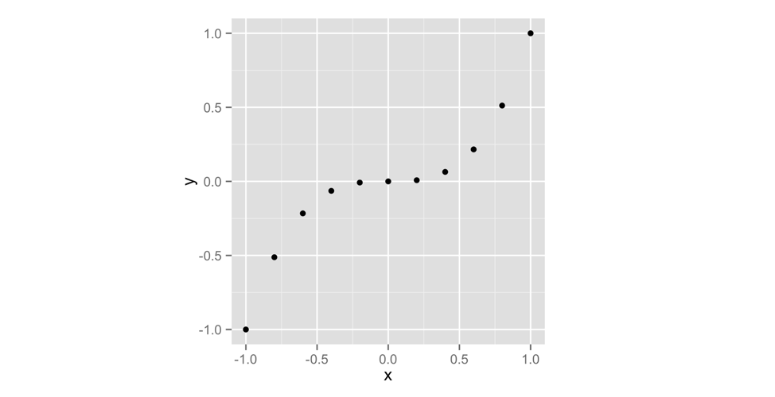
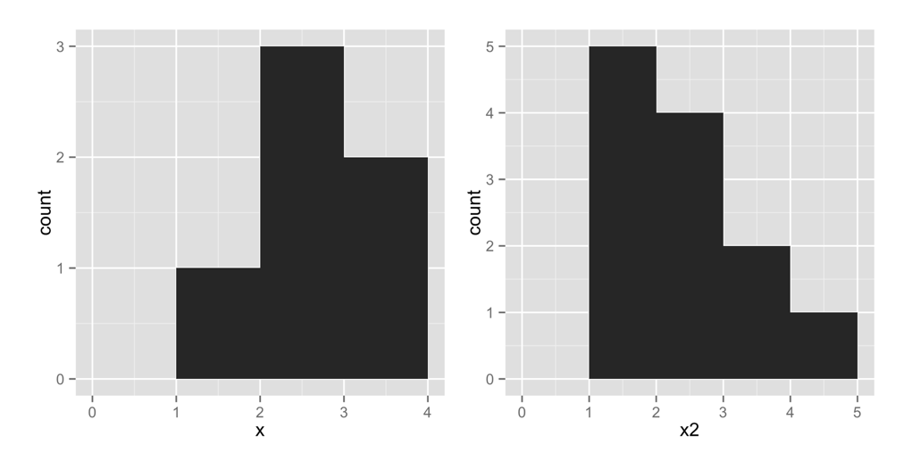
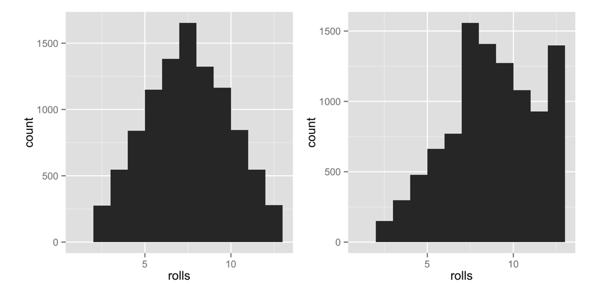

# Packages and Help Pages {#packages}

You now have a function that simulates rolling a pair of dice. Let's make things a little more interesting by weighting the dice in your favor. The house always wins, right? Let's make the dice roll high numbers slightly more often than it rolls low numbers. 

Before we weight the dice, we should make sure that they are fair to begin with. Two tools will help you do this: _repetition_ and _visualization_. By coincidence, these tools are also two of the most useful superpowers in the world of data science. 

We will repeat our dice rolls with a function called `replicate`, and we will visualize our rolls with a function called `qplot`. `qplot` does not come with R when you download it; `qplot` comes in a standalone R package. Many of the most useful R tools come in R packages, so let's take a moment to look at what R packages are and how you can use them.

## Packages

You're not the only person writing your own functions with R. Many professors, programmers, and statisticians use R to design tools that can help people analyze data. They then make these tools free for anyone to use. To use these tools, you just have to download them. They come as preassembled collections of functions and objects called packages. [Appendix 2: R Packages](#packages2) contains detailed instructions for downloading and updating R packages, but we'll look at the basics here.

We're going to use the `qplot` function to make some quick plots. `qplot` comes in the _ggplot2_ package, a popular package for making graphs. Before you can use `qplot`, or anything else in the ggplot2 package, you need to download and install it.

### install.packages

Each R package is hosted at [http://cran.r-project.org](http://cran.r-project.org), the same website that hosts R. However, you don't need to visit the website to download an R package; you can download packages straight from R's command line. Here's how: 

* Open RStudio.
* Make sure you are connected to the Internet.
* Run *`install.packages("ggplot2")`* at the command line.

That's it. R will have your computer visit the website, download ggplot2, and install the package in your hard drive right where R wants to find it. You now have the ggplot2 package. If you would like to install another package, replace ggplot2 with your package name in the code.

### library

Installing a package doesn't place its functions at your fingertips just yet: it simply places them in your hard drive. To use an R package, you next have to load it in your R session with the command *`library("ggplot2")`*. If you would like to load a different package, replace ggplot2 with your package name in the code.

To see what this does, try an experiment. First, ask R to show you the `qplot` function. R won't be able to find `qplot` because `qplot` lives in the ggplot2 package, which you haven't loaded:

```r
qplot
## Error: object 'qplot' not found
```

Now load the ggplot2 package:

```r
library("ggplot2")
```

If you installed the package with `install.packages` as instructed, everything should go fine. Don't worry if you don't see any results or messages. No news is fine news when loading a package. Don't worry if you do see a message either; ggplot2 sometimes displays helpful start up messages. As long as you do not see anything that says "Error," you are doing fine.

Now if you ask to see `qplot`, R will show you quite a bit of code (`qplot` is a long function):

```r
qplot
## (quite a bit of code)
```

[Appendix 2: R Packages](#packages2) contains many more details about acquiring and using packages. I recommend that you read it if you are unfamiliar with R's package system. The main thing to remember is that you only need to install a package once, but you need to load it with `library` each time you wish to use it in a new R session. R will unload all of its packages each time you close RStudio.

Now that you've loaded `qplot`, let's take it for a spin. `qplot` makes "quick plots." If you give `qplot` two vectors of equal lengths, `qplot` will draw a scatterplot for you. `qplot` will use the first vector as a set of x values and the second vector as a set of y values. Look for the plot to appear in the Plots tab of the bottom-right pane in your RStudio window. 

The following code will make the plot that appears in Figure \@ref(fig:qplot). Until now, we've been creating sequences of numbers with the `:` operator; but you can also create vectors of numbers with the `c` function. Give `c` all of the numbers that you want to appear in the vector, separated by a comma. `c` stands for _concatenate_, but you can think of it as "collect" or "combine":

```r
x <- c(-1, -0.8, -0.6, -0.4, -0.2, 0, 0.2, 0.4, 0.6, 0.8, 1)
x
## -1.0 -0.8 -0.6 -0.4 -0.2  0.0  0.2  0.4  0.6  0.8  1.0

y <- x^3
y
## -1.000 -0.512 -0.216 -0.064 -0.008  0.000  0.008
##  0.064  0.216  0.512  1.000

qplot(x, y)
```

```{r qplot, echo = FALSE, fig.cap = "qplot makes a scatterplot when you give it two vectors."}

```

You don't need to name your vectors `x` and `y`. I just did that to make the example clear. As you can see in Figure \@ref(fig:qplot), a scatterplot is a set of points, each plotted according to its x and y values. Together, the vectors `x` and `y` describe a set of 10 points. How did R match up the values in `x` and `y` to make these points? With element-wise execution, as we saw in Figure \@ref(fig:elementwise).

Scatterplots are useful for visualizing the relationship between two variables. However, we're going to use a different type of graph, a _histogram_. A histogram visualizes the distribution of a single variable; it displays how many data points appear at each value of x. 

Let's take a look at a histogram to see if this makes sense. `qplot` will make a histogram whenever you give it only _one_ vector to plot. The following code makes the left-hand plot in Figure \@ref(fig:hist) (we'll worry about the right-hand plot in just second). To make sure our graphs look the same, use the extra argument *`binwidth = 1`*:

```r
x <- c(1, 2, 2, 2, 3, 3)
qplot(x, binwidth = 1)
```

```{r hist, echo = FALSE, fig.cap = "qplot makes a histogram when you give it a single vector."}

```

This plot shows that our vector contains one value in the interval `[1, 2)` by placing a bar of height 1 above that interval. Similarly, the plot shows that the vector contains three values in the interval `[2, 3)` by placing a bar of height 3 in that interval. It shows that the vector contains two values in the interval `[3, 4)` by placing a bar of height 2 in that interval. In these intervals, the hard bracket, `[`, means that the first number is included in the interval. The parenthesis, `)`, means that the last number is _not_ included.

Let's try another histogram. This code makes the right-hand plot in Figure \@ref(fig:hist). Notice that there are five points with a value of 1 in `x2`. The histogram displays this by plotting a bar of height 5 above the interval x2 = [1, 2):

```r
x2 <- c(1, 1, 1, 1, 1, 2, 2, 2, 2, 3, 3, 4)
qplot(x2, binwidth = 1)
```

```{exercise, name = "Visualize a Histogram"}
Let `x3` be the following vector:
```

`x3 <- c(0, 1, 1, 2, 2, 2, 3, 3, 4)`

Imagine what a histogram of `x3` would look like. Assume that the histogram has a bin width of 1. How many bars will the histogram have? Where will they appear? How high will each be?

When you are done, plot a histogram of `x3` with `binwidth = 1`, and see if you are right.


```{solution}
You can make a histogram of `x3` with `qplot(x3, binwidth = 1)`. The histogram will look like a symmetric pyramid. The middle bar will have a height of 3 and will appear above `[2, 3)`, but be sure to try it and see for yourself.
```

You can use a histogram to display visually how common different values of `x` are. Numbers covered by a tall bar are more common than numbers covered by a short bar.

How can you use a histogram to check the accuracy of your dice? 

Well, if you roll your dice many times and keep track of the results, you would expect some numbers to occur more than others. This is because there are more ways to get some numbers by adding two dice together than to get other numbers, as shown in Figure \@ref(fig:probs). 

If you roll your dice many times and plot the results with `qplot`, the histogram will show you how often each sum appeared. The sums that occurred most often will have the highest bars. The histogram should look like the pattern in Figure \@ref(fig:probs) if the dice are fairly weighted.

This is where `replicate` comes in. `replicate` provides an easy way to repeat an R command many times. To use it, first give `replicate` the number of times you wish to repeat an R command, and then give it the command you wish to repeat. `replicate` will run the command multiple times and store the results as a vector:

```r
replicate(3, 1 + 1)
## 2 2 2

replicate(10, roll())
## 3  7  5  3  6  2  3  8 11  7
```

```{r probs, echo = FALSE, fig.cap = "Each individual dice combination should occur with the same frequency. As a result, some sums will occur more often than others. With fair dice, each sum should appear in proportion to the number of combinations that make it."}
knitr::include_graphics("images/hopr_0203.png")
```

A histogram of your first 10 rolls probably won't look like the pattern shown in Figure \@ref(fig:probs). Why not? There is too much randomness involved. Remember that we use dice in real life because they are effective random number generators. Patterns of long run frequencies will only appear _over the long run_. So let's simulate 10,000 dice rolls and plot the results. Don't worry; `qplot` and `replicate` can handle it. The results appear in Figure \@ref(fig:fair):

```r
rolls <- replicate(10000, roll())
qplot(rolls, binwidth = 1)
```

The results suggest that the dice are fair. Over the long run, each number occurs in proportion to the number of combinations that generate it.

Now how can you bias these results? The previous pattern occurs because each underlying combination of dice (e.g., (3,4)) occurs with the same frequency. If you could increase the probability that a 6 is rolled on either die, then any combination with a six in it will occur more often than any combination without a six in it. The combination (6, 6) would occur most of all. This won't make the dice add up to 12 more often than they add up to seven, but it will skew the results toward the higher numbers.

```{r fair, echo = FALSE, fig.cap = "The behavior of our dice suggests that they are fair. Seven occurs more often than any other number, and frequencies diminish in proportion to the number of die combinations that create each number."}
knitr::include_graphics("images/hopr_0204.png")
```

To put it another way, the probability of rolling any single number on a fair die is 1/6. I'd like you to change the probability to 1/8 for each number below six, and then increase the probability of rolling a six to 3/8:

|Number|Fair probability|Weighted probability
|------|----------------|--------------------
|1|1/6|1/8
|2|1/6|1/8
|3|1/6|1/8
|4|1/6|1/8
|5|1/6|1/8
|6|1/6|3/8

You can change the probabilities by adding a new argument to the `sample` function. I'm not going to tell you what the argument is; instead I'll point you to the help page for the `sample` function. What's that? R functions come with help pages? Yes they do, so let's learn how to read one. 

## Getting Help with Help Pages

There are over 1,000 functions at the core of R, and new R functions are created all of the time. This can be a lot of material to memorize and learn! Luckily, each R function comes with its own help page, which you can access by typing the function's name after a question mark. For example, each of these commands will open a help page. Look for the pages to appear in the Help tab of RStudio's bottom-right pane:

```r
?sqrt
?log10
?sample
```

Help pages contain useful information about what each function does. These help pages also serve as code documentation, so reading them can be bittersweet. They often seem to be written for people who already understand the function and do not need help. 

Don't let this bother you—you can gain a lot from a help page by scanning it for information that makes sense and glossing over the rest. This technique will inevitably bring you to the most helpful part of each help page: the bottom. Here, almost every help page includes some example code that puts the function in action. Running this code is a great way to learn by example.

```{block2, type = "rmdwarning"}
If a function comes in an R package, R won't be able to find its help page unless the package is loaded.
```

### Parts of a Help Page

Each help page is divided into sections. Which sections appear can vary from help page to help page, but you can usually expect to find these useful topics:

**Description** - A short summary of what the function does.

**Usage** - An example of how you would type the function. Each argument of the function will appear in the order R expects you to supply it (if you don't use argument names).

**Arguments** -  A list of each argument the function takes, what type of information R expects you to supply for the argument, and what the function will do with the information.

**Details** - A more in-depth description of the function and how it operates. The details section also gives the function author a chance to alert you to anything you might want to know when using the function.

**Value** - A description of what the function returns when you run it.

**See Also** - A short list of related R functions.

**Examples** - Example code that uses the function and is guaranteed to work. The examples section of a help page usually demonstrates a couple different ways to use a function. This helps give you an idea of what the function is capable of.

If you'd like to look up the help page for a function but have forgotten the function's name, you can search by keyword. To do this, type two question marks followed by a keyword in R's command line. R will pull up a list of links to help pages related to the keyword. You can think of this as the help page for the help page:

```r
??log
```

Let's take a stroll through `sample`'s help page. Remember: we're searching for anything that could help you change the probabilities involved in the sampling process. I'm not going to reproduce the whole help page here (just the juiciest parts), so you should follow along on your computer.

First, open the help page. It will appear in the same pane in RStudio as your plots did (but in the Help tab, not the Plots tab):

```r
?sample
```

What do you see? Starting from the top:

```

Random Samples and Permutations

Description
    sample takes a sample of the specified size from the elements of x using 
either with or without replacement.
```

So far, so good. You knew all of that. The next section, Usage, has a possible clue. It mentions an argument called `prob`:

```
Usage
    sample(x, size, replace = FALSE, prob = NULL)
```

If you scroll down to the arguments section, the description of +prob+ sounds _very_ promising:

```
A vector of probability weights for obtaining the elements of the vector being 
sampled.
```

The Details section confirms our suspicions. In this case, it also tells you how to proceed:

```
The optional prob argument can be used to give a vector of weights for obtaining 
the elements of the vector being sampled. They need not sum to one, but they 
should be nonnegative and not all zero.
```

Although the help page does not say it here, these weights will be matched up to the elements being sampled in element-wise fashion. The first weight will describe the first element, the second weight the second element, and so on. This is common practice in R.

Reading on:

```
If replace is true, Walker's alias method (Ripley, 1987) is used...
```

Okay, that looks like time to start skimming. We should have enough info now to figure out how to weight our dice.

```{exercise, name = "Roll a Pair of Dice"}
Rewrite the `roll` function below to roll a pair of weighted dice:
```

```r
roll <- function() {
  die <- 1:6
  dice <- sample(die, size = 2, replace = TRUE)
  sum(dice)
}
```
You will need to add a `prob` argument to the `sample` function inside of `roll`. This argument should tell `sample` to sample the numbers one through five with probability 1/8 and the number 6 with probability 3/8.

When you are finished, read on for a model answer.

```{solution}
To weight your dice, you need to add a `prob` argument with a vector of weights to `sample`, like this:
```

```r
roll <- function() {
  die <- 1:6
  dice <- sample(die, size = 2, replace = TRUE, 
    prob = c(1/8, 1/8, 1/8, 1/8, 1/8, 3/8))
  sum(dice)
}
```

This will cause `roll` to pick 1 through 5 with probability 1/8 and 6 with probability 3/8.

Overwrite your previous version of `roll` with the new function (by running the previous code snippet in your command line). Then visualize the new long-term behavior of your dice. I've put the results in Figure \@ref(fig:weighted) next to our original results:

```r
rolls <- replicate(10000, roll())
qplot(rolls, binwidth = 1)
```

This confirms that we've effectively weighted the dice. High numbers occur much more often than low numbers. The remarkable thing is that this behavior will only be apparent when you examine long-term frequencies. On any single roll, the dice will appear to behave randomly. This is great news if you play Settlers of Catan (just tell your friends you lost the dice), but it should be disturbing if you analyze data, because it means that bias can easily occur without anyone noticing it in the short run.

```{r weighted, echo = FALSE, fig.cap = "The dice are now clearly biased towards high numbers, since high sums occur much more often than low sums."}

```

### Getting More Help

R also comes with a super active community of users that you can turn to for [help on the R-help mailing list](http://bit.ly/r-help). You can email the list with questions, but there's a great chance that your question has already been answered. Find out by searching the [archives](http://bit.ly/R_archives).

Even better than the R-help list is [Stack Overflow](http://stackoverflow.com), a website that allows programmers to answer questions and users to rank answers based on helpfulness. Personally, I find the Stack Overflow format to be more user-friendly than the R-help email list (and the respondents to be more human friendly). You can submit your own question or search through Stack Overflow's previously answered questions related to R. There are over 30,000.

Best of all is [community.rstudio.com](http://community.rstudio.com), a friendly, inclusive place to share questions related to R. community.rstudio.com is a very active forum focused on R. Don't be surprised if you ask a question about an R package, and the author of the package shows up to answer.

For all of the R help list, Stack Overflow, and community.rstudio.com, you're more likely to get a useful answer if you provide a reproducible example with your question. This means pasting in a short snippet of code that users can run to arrive at the bug or question you have in mind.

## Summary

R's packages and help pages can make you a more productive programmer. You saw in [The Very Basics](#basics) that R gives you the power to write your own functions that do specific things, but often the function that you want to write will already exist in an R package. Professors, programmers, and scientists have developed over 13,000 packages for you to use, which can save you valuable programming time. To use a package, you need to install it to your computer once with `install.packages`, and then load it into each new R session with `library`.

R's help pages will help you master the functions that appear in R and its packages. Each function and data set in R has its own help page. Although help pages often contain advanced content, they also contain valuable clues and examples that can help you learn how to use a function.

You have now seen enough of R to learn by doing, which is the best way to learn R. You can make your own R commands, run them, and get help when you need to understand something that I have not explained. I encourage you to experiment with your own ideas in R as you read through the next two projects.

## Project 1 Wrap-up

You've done more in this project than enable fraud and gambling; you've also learned how to speak to your computer in the language of R. R is a language like English, Spanish, or German, except R helps you talk to computers, not humans.

You've met the nouns of the R language, objects. And hopefully you guessed that functions are the verbs (I suppose function arguments would be the adverbs). When you combine functions and objects, you express a complete thought. By stringing thoughts together in a logical sequence, you can build eloquent, even artistic statements. In that respect, R is not that different than any other language.

R shares another characteristic of human languages: you won't feel very comfortable speaking R until you build up a vocabulary of R commands to use. Fortunately, you don't have to be bashful. Your computer will be the only one to "hear" you speak R. Your computer is not very forgiving, but it also doesn't judge. Not that you need to worry; you'll broaden your R vocabulary tremendously between here and the end of the book. 

Now that you can use R, it is time to become an expert at using R to do data science. The foundation of data science is the ability to store large amounts of data and recall values on demand. From this, all else follows—manipulating data, visualizing data, modeling data, and more. However, you cannot easily store a data set in your mind by memorizing it. Nor can you easily store a data set on paper by writing it down. The only efficient way to store large amounts of data is with a computer. In fact, computers are so efficient that their development over the last three decades has completely changed the type of data we can accumulate and the methods we can use to analyze it. In short, computer data storage has driven the revolution in science that we call data science.

[Project 2: Playing Cards] will make you part of this revolution by teaching you how to use R to store data sets in your computer's memory and how to retrieve and manipulate data once it's there. 
